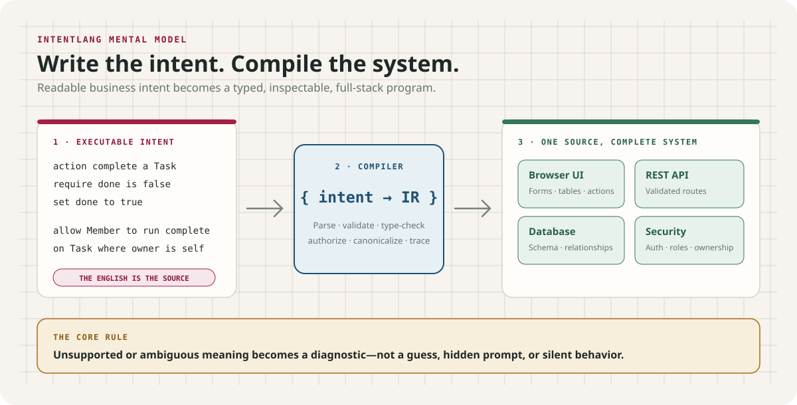

# IntentLang


## What if software requirements were executable?

**IntentLang turns application intent into the program itself.** Data models,
relationships, business rules, workflows, permissions, and interface behavior
are written in controlled English and compiled into a working full-stack
system.

Software intent normally passes through requirements, tickets, architecture,
code, database schemas, APIs, security rules, and tests. Every translation can
lose meaning. IntentLang collapses that chain: the source stays readable enough
to review as intent and precise enough to execute as software.

This is **not prompt-to-code** and not arbitrary natural language. There is no
hidden model guessing what the author meant. Accepted sentences have defined
semantics; unsupported or ambiguous instructions fail explicitly.

**The English is the source code. The compiler is the authority.**



> [!WARNING]
> IntentLang `v0.8.0-alpha.0` is experimental. It is not production-ready or
> intended for sensitive data, and it intentionally rejects unsupported or
> ambiguous instructions.

## A language for intent, not implementation noise

```text
application Todo
authentication uses User identified by email

role Member

a User has a required name as text
a User has a required unique email as text length between 1 and 320
a Task has a required title as text length between 1 and 200
a Task has a done as boolean default false
each Task belongs to a User as owner on delete restrict

action complete a Task
  require done is false otherwise "Task is already complete"
  set done to true

allow Member to read User where self
allow Member to create Task with owner as self
allow Member to read Task where owner is self
allow Member to update Task where owner is self
allow Member to run complete on Task where owner is self
```

Those statements are not comments, documentation, or an AI prompt. They define
the application's data, ownership, authorization, and state transition. The
compiler turns them into a typed application model and generates:

- Responsive browser UI with forms, tables, relationships, and workflow actions
- Node.js backend and validated REST API
- SQLite schema, constraints, foreign keys, and migration plans
- Authentication, role-based authorization, owner scoping, CSRF protection,
  idempotency, optimistic concurrency, and audit records
- Canonical source, semantic fingerprints, manifests, and source-to-artifact
  traceability

## Proof: real systems built from IntentLang

- **[LaunchOps Mission Control](docs/launch-ops-full-stack.md)** — program
  launches, milestones, work, risks, decisions, updates, 14 workflows, and 4
  roles. [Read the source](examples/launch-ops.intent).
- **[Atlas Grid](docs/atlas-grid-full-stack.md)** — a global supply-chain
  resilience control tower with 10 entities, 18 workflows, and 155 permissions.
  [Read the source](examples/atlas-grid.intent).
- **[GridShield](docs/grid-shield-full-stack.md)** — an electric-utility outage
  restoration system with 11 entities, 24 workflows, and 171 permissions.
  [Read the source](examples/grid-shield.intent).

Each case study links to the controlled-English source, complete generated
frontend/backend/database snapshot, and real desktop and mobile screenshots.
**[Explore the full example gallery](examples/README.md).**

## Choose your authoring path

- **Code** is the direct IntentLang IDE for writing the formal business
  language with autocomplete, diagnostics, formatting, and a live application
  model. Start here when editing an existing `.intent` file.
- **App Builder** is a guided path for turning a finite set of supported
  business-app descriptions into reviewable IntentLang source. It reports
  unsupported requests instead of silently improvising. See
  [Describe App mode](docs/description-mode.md).
- **Visual Language** is a separate controlled-English grammar for pages,
  styling, layout, animation, forms, and safe browser interactions. See the
  [visual language guide](docs/visual-language.md).

## More than business applications

IntentLang also includes an experimental visual/page language:

```text
Show Hello, world!
Make the text large, blue and bold
Make the background white
Move the text from left to right over 3 seconds
```

See the [visual language guide](docs/visual-language.md) and
[example gallery](examples/README.md).

## Try it

Requires Node.js 24+.

```bash
git clone https://github.com/sethiramicrosoft/intentlang.git
cd intentlang
npm install
npm run sample:studio
```

Open `http://127.0.0.1:3211` if Studio does not open automatically.

To inspect the compiler pipeline from the command line:

```bash
npm run sample:check
npm run sample:format
npm run sample:compile
npm run sample:generate
```

See [Getting started](docs/getting-started.md) for installation, generated-app
startup, and safe account bootstrap instructions.

## What works today

- Deterministic parsing, formatting, compilation, and generation
- Business entities, relationships, validation, roles, scoped permissions,
  policies, workflows, and state machines
- Exact decimals, money, dates, typed functions, records, collections, and
  authorization-aware queries
- Transactions, rollback, idempotency, typed external contracts, bounded
  retries/timeouts, and capability-scoped escape hatches
- Modules, imports, namespaces, dependency locks, and semantic compatibility
- Studio, App Builder wizard, LSP, REPL, debugger, conformance runner, semantic
  manifest validator, and backend parity checker
- Visual pages with validated HTML/CSS, forms, layout, and safe interactions

This is **controlled English**, not arbitrary natural-language programming.
Unsupported meaning is rejected rather than guessed. See
[Project status and limitations](docs/project/status.md).

## Documentation

| Goal | Read |
|---|---|
| Install and run IntentLang | [Getting started](docs/getting-started.md) |
| Understand every Studio feature | [Studio feature guide](docs/studio.md) |
| Learn the business language | [Business language specification](docs/spec/business-core.md) |
| Build visual pages | [Visual language guide](docs/visual-language.md) |
| Use Studio and the App Builder | [Describe App mode](docs/description-mode.md) |
| Review the flagship application | [LaunchOps case study](docs/launch-ops-full-stack.md) |
| Review another generated full-stack app | [Issue Tracker case study](docs/issue-tracker-full-stack.md) |
| Look up commands | [CLI reference](docs/reference/cli.md) |
| Understand safety and limitations | [Project status and limitations](docs/project/status.md) |
| Report or evaluate a vulnerability | [Security policy](SECURITY.md) |
| Inspect formal language assurance | [Normative specification index](docs/spec/index.md) |
| Review language-change requirements | [Language governance](docs/spec/language-governance.md) |
| Contribute | [Contributing guide](CONTRIBUTING.md) |

The complete categorized list is in the
[documentation index](docs/README.md), but every primary path is linked
directly above.

## Project status

IntentLang is currently `v0.8.0-alpha.0`. Generated applications are for
experimentation and evaluation, not production deployment.

No software license has been selected yet. Reuse rights are not granted beyond
GitHub's viewing and forking terms.
