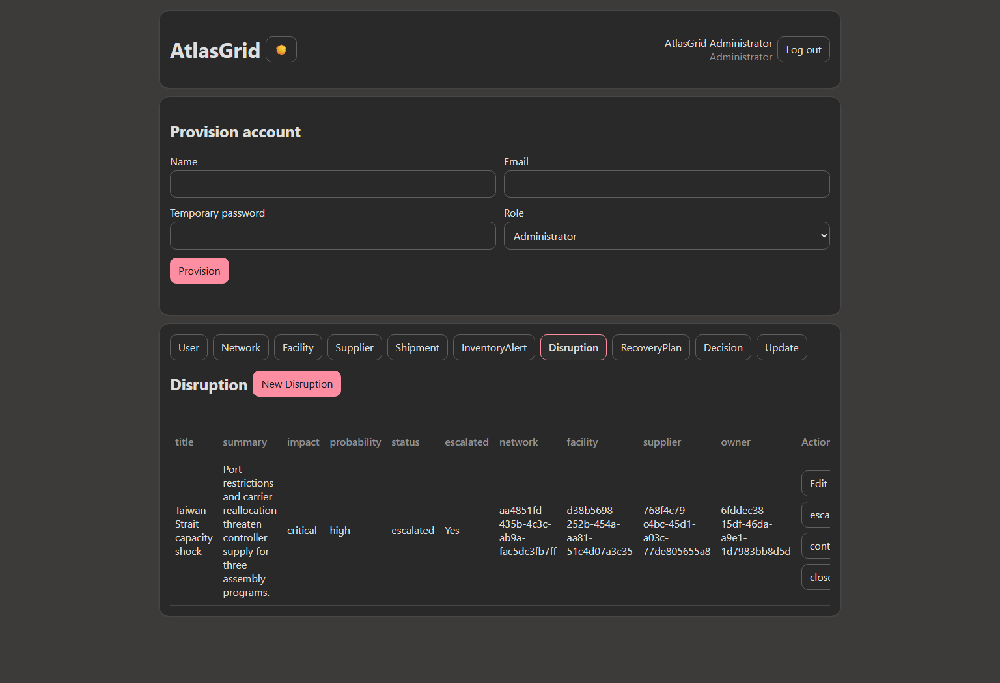
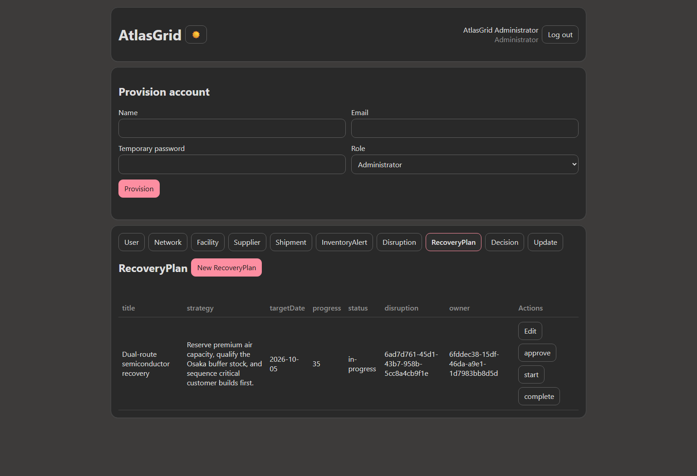
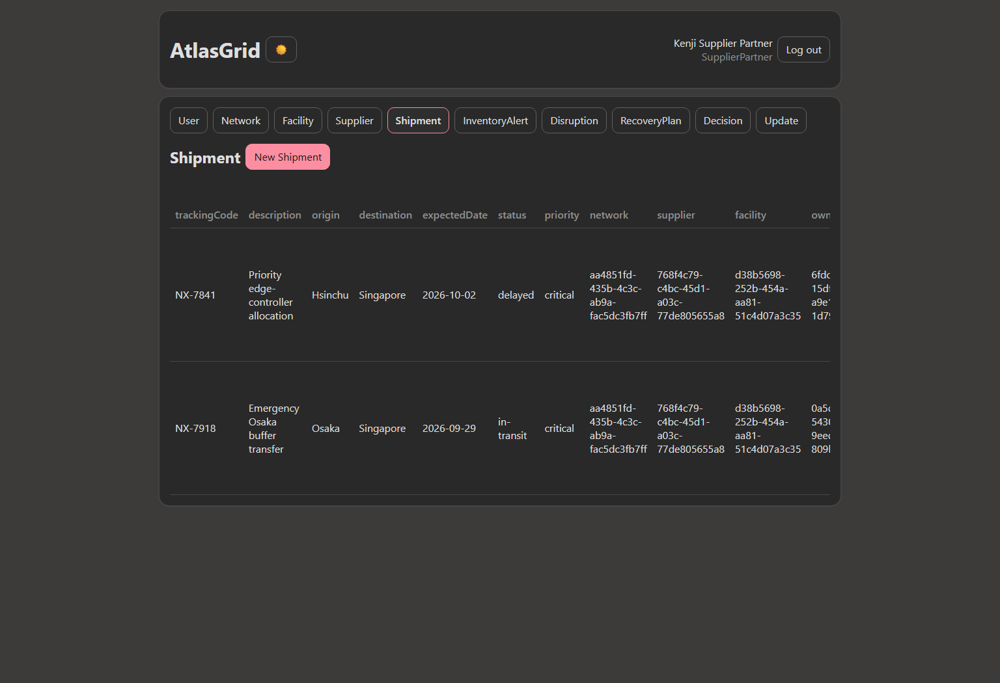
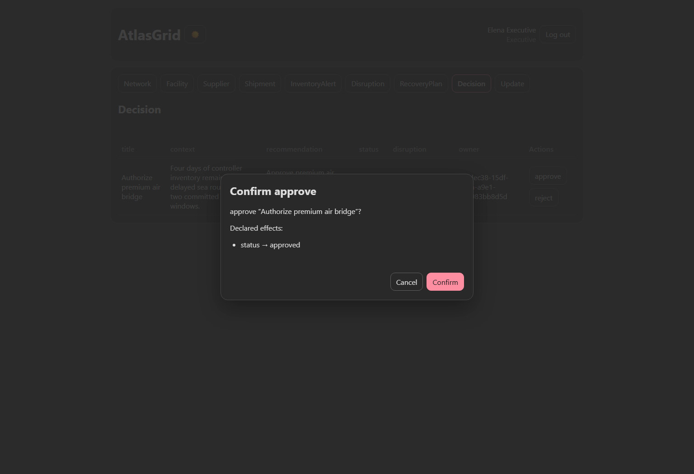
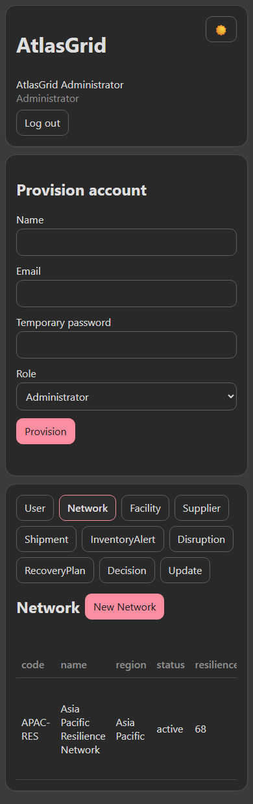

# Atlas Grid: global supply-chain resilience control tower

Atlas Grid is a complex, authenticated full-stack application generated
deterministically from
[`examples/atlas-grid.intent`](../examples/atlas-grid.intent). It coordinates
facilities, suppliers, shipments, inventory alerts, disruptions, recovery
plans, executive decisions, and operational updates across a global network.

> The controlled-English source is the program. The Node.js server, REST API,
> SQLite schema, browser UI, workflows, and authorization controls are compiler
> output.

## Scale

- 10 entities
- 49 business fields
- 21 foreign-key relationships
- 18 guarded workflow actions
- 5 operational roles
- 154 expanded explicit permissions
- 0 compiler diagnostics

## Operational model

| Entity | Purpose | Representative workflow |
|---|---|---|
| Network | Regional resilience portfolio | monitoring → active → stable |
| Facility | Manufacturing or logistics site | operational → restricted → restored |
| Supplier | Critical external partner | risk and operating context |
| Shipment | Material movement and commitment | planned → in-transit/delayed → delivered |
| InventoryAlert | Days-of-supply exception | open → acknowledged → resolved |
| Disruption | Cross-network incident | detected → escalated → contained → closed |
| RecoveryPlan | Coordinated response strategy | draft → approved → in-progress → complete |
| Decision | Executive funding or risk decision | pending → approved/rejected |
| Update | Audience-specific communication | draft → published |
| User | Authenticated identity and ownership | provisioned by an Administrator |

## A real disruption scenario

The checked browser walkthrough creates the **Asia Pacific Resilience Network**,
the Singapore assembly hub, a critical semiconductor supplier, two shipments,
an inventory shortage, a regional disruption, a recovery plan, an executive
decision, and a published red-status update.

The Administrator then:

1. Activates the regional network.
2. Restricts the affected facility.
3. Dispatches and delays the threatened shipment.
4. Acknowledges the four-day inventory alert.
5. Escalates the disruption.
6. Approves and starts the dual-route recovery plan.
7. Publishes the executive update.

A Supplier Partner signs in separately, creates and dispatches an emergency
Osaka buffer shipment, and sees only role-appropriate controls. An Executive
signs in without create/edit access and approves the premium air-bridge
decision after reviewing the exact declared effect.

## Screenshots from the generated application

### Escalated disruption



### Recovery plan in progress



### Supplier-operated emergency shipment



### Executive approval



### Responsive mobile view



## Readable workflow and authorization

```text
state machine DisruptionLifecycle for Disruption using status
  transition escalate
    require escalated is false otherwise "Disruption is already escalated"
    set escalated to true
    set status to "escalated"
  transition contain
    require status is "escalated" otherwise "Only an escalated disruption can be contained"
    set status to "contained"
  transition close
    require status is "contained" otherwise "Only a contained disruption can be closed"
    set escalated to false
    set status to "closed"
```

```text
policy SupplierPartnerAccess
  allow to read self User
  allow to read Network, Facility, Supplier, InventoryAlert, Disruption, RecoveryPlan, Decision and Update
  allow to create and update own Shipment
  allow to run all actions on own Shipment
```

The concise policy expands before validation into explicit default-deny
permissions enforced independently by both the generated browser and server.

## Generated artifacts

- [Controlled-English source](../examples/atlas-grid.intent)
- [Generated application](../examples/atlas-grid-generated/)
- [SQLite migration](../examples/atlas-grid-generated/migration.sql)
- [Typed manifest](../examples/atlas-grid-generated/intentlang.manifest.json)
- [Browser client](../examples/atlas-grid-generated/app.js)
- [Node.js runtime](../examples/atlas-grid-generated/app.mjs)
- [Executable browser walkthrough](../atlas-grid-drive.mjs)

## Run a writable copy

Keep the committed generated snapshot read-only:

```powershell
node --import tsx src\cli.ts generate examples\atlas-grid.intent `
  --output examples\atlas-grid-app --write --force --allow-security-downgrade
```

Follow [Getting started](getting-started.md) for safe first-account bootstrap.
The current generated runtime is intended for local evaluation, not production
deployment.
