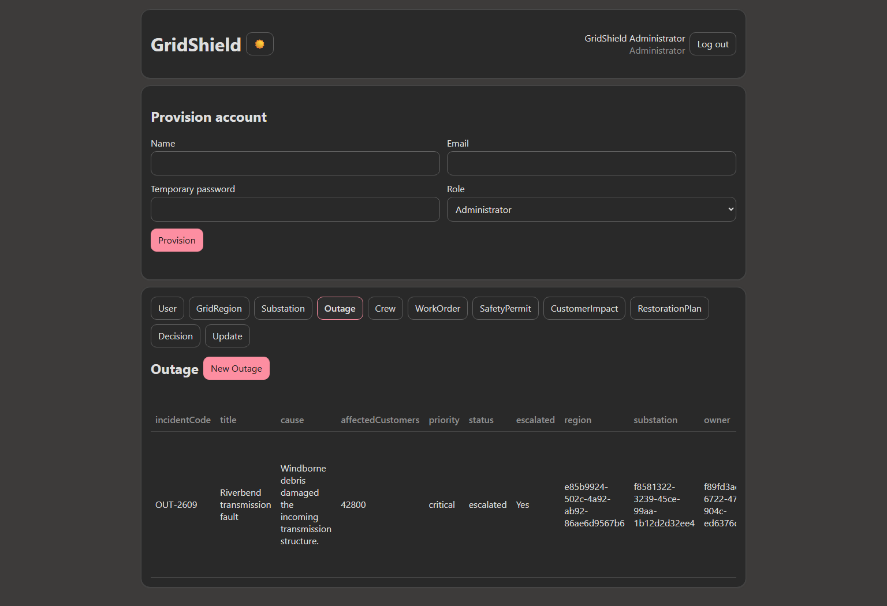
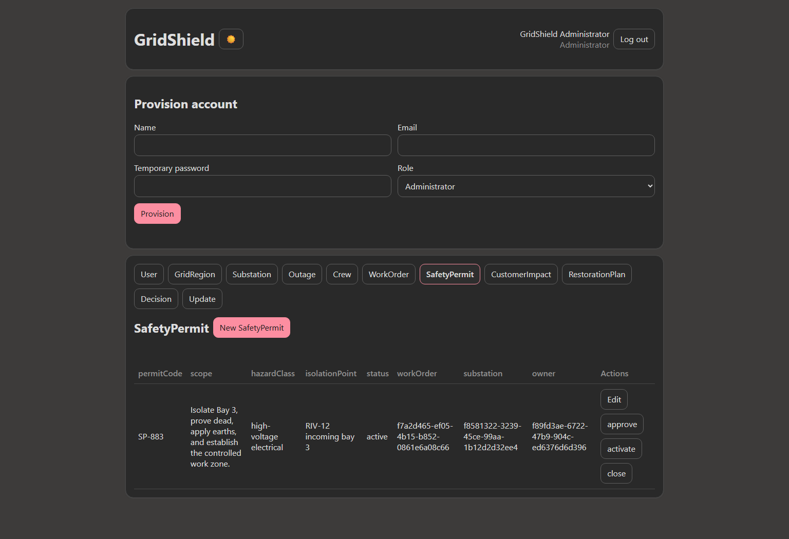
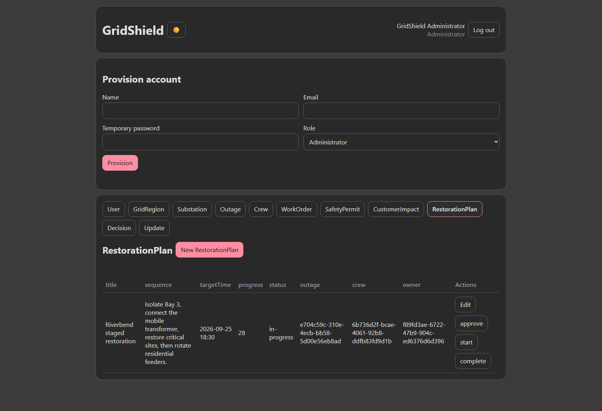
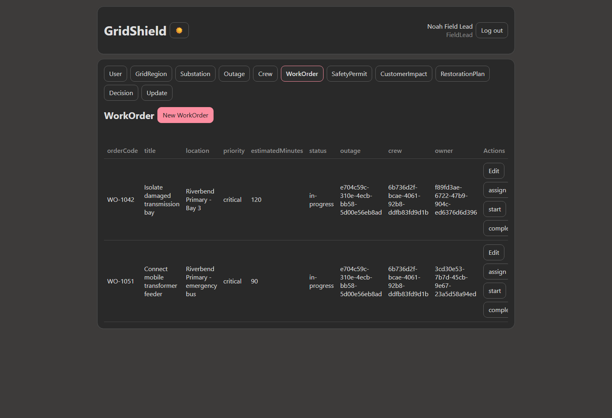
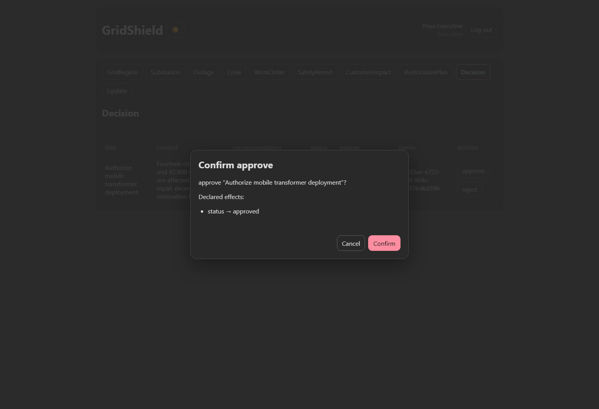
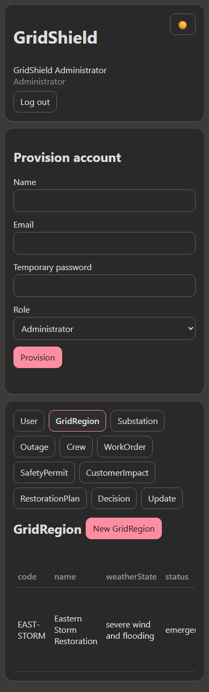

# GridShield: utility outage restoration command

GridShield is an authenticated electric-utility incident and restoration system
generated from
[`examples/grid-shield.intent`](../examples/grid-shield.intent). It coordinates
grid regions, substations, outages, crews, work orders, safety permits, customer
impacts, restoration plans, executive decisions, and operational updates.

## Scale

- 11 entities
- 55 business fields
- 23 foreign-key relationships
- 24 guarded workflow actions
- 5 operational roles
- 171 expanded explicit permissions
- 0 compiler diagnostics

## Coordinated restoration model

| Entity | Operational responsibility |
|---|---|
| GridRegion | Declares and recovers a regional emergency |
| Substation | Isolation, load removal, and safe re-energization |
| Outage | Assessment, escalation, containment, and restoration |
| Crew | Availability, deployment, and release |
| WorkOrder | Dispatch queue through field completion |
| SafetyPermit | Approval, activation, and closeout of hazardous work |
| CustomerImpact | Critical-site and customer notification tracking |
| RestorationPlan | Approved restoration sequence and progress |
| Decision | Executive authorization for emergency resources |
| Update | Public, operational, and executive communication |
| User | Authenticated identity and record ownership |

## Verified storm scenario

The browser walkthrough creates a severe-weather emergency affecting 42,800
customers and 14 critical sites. It isolates Riverbend Primary Substation,
deploys a high-voltage crew, starts a controlled work order, activates a safety
permit, notifies the affected area, and begins a staged restoration plan.

A Field Lead signs in separately and creates an owner-scoped emergency work
order. An Executive receives a read-only incident picture and authorizes a
mobile transformer through the generated workflow confirmation.

## Screenshots from the generated application

### Escalated outage command



### Active safety permit



### Restoration plan in progress



### Field Lead work execution



### Executive resource authorization



### Responsive mobile command view



## Safety-critical workflow remains explicit

```text
state machine SafetyPermitLifecycle for SafetyPermit using status
  transition approve
    require status is "draft" otherwise "Only a draft safety permit can be approved"
    set status to "approved"
  transition activate
    require status is "approved" otherwise "Only an approved safety permit can be activated"
    set status to "active"
  transition close
    require status is "active" otherwise "Only an active safety permit can be closed"
    set status to "closed"
```

The generated server rechecks every transition and permission. Browser buttons
are convenience controls, not the authorization boundary.

## Generated artifacts

- [Controlled-English source](../examples/grid-shield.intent)
- [Generated application](../examples/grid-shield-generated/)
- [SQLite migration](../examples/grid-shield-generated/migration.sql)
- [Typed manifest](../examples/grid-shield-generated/intentlang.manifest.json)
- [Browser client](../examples/grid-shield-generated/app.js)
- [Node.js runtime](../examples/grid-shield-generated/app.mjs)
- [Executable browser walkthrough](../grid-shield-drive.mjs)

Generate a writable local copy:

```powershell
node --import tsx src\cli.ts generate examples\grid-shield.intent `
  --output examples\grid-shield-app --write --force --allow-security-downgrade
```

See [Getting started](getting-started.md) for safe account bootstrap and local
runtime instructions.
