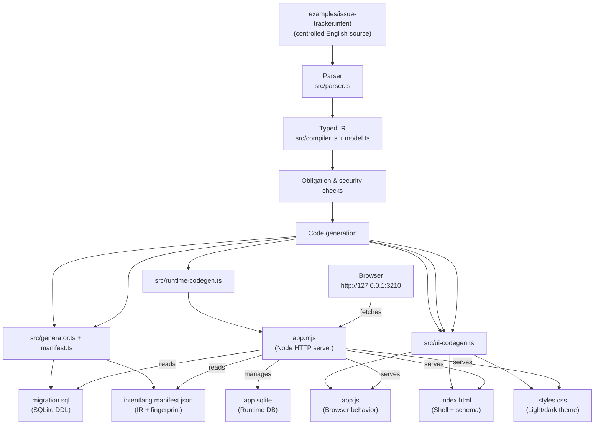

# Building a full-stack Issue Tracker with English and no AI

> **Proof:** one `.intent` controlled-English source file generated a
> complete frontend, backend, and database — no model inference, no API
> calls, no AI subscription, no tokens consumed at any stage.

## Table of contents

1. [Goal and what was proved](#1-goal-and-what-was-proved)
2. [Controlled English vs arbitrary English](#2-controlled-english-vs-arbitrary-english)
3. [Files used in this proof](#3-files-used-in-this-proof)
4. [The source file: complete and explained](#4-the-source-file-complete-and-explained)
5. [Exact pipeline: source to running app](#5-exact-pipeline-source-to-running-app)
6. [Commands — beginner-friendly guide](#6-commands--beginner-friendly-guide)
7. [Safe bootstrap instructions](#7-safe-bootstrap-instructions)
8. [What files were generated](#8-what-files-were-generated)
9. [Frontend layer](#9-frontend-layer)
10. [Backend layer](#10-backend-layer)
11. [Database layer](#11-database-layer)
12. [Typed IR and manifest](#12-typed-ir-and-manifest)
13. [Runtime walkthrough: what was actually tested](#13-runtime-walkthrough-what-was-actually-tested)
14. [Layer map and diagram](#14-layer-map-and-diagram)
15. [What "full stack" means here](#15-what-full-stack-means-here)
16. [Troubleshooting and FAQ](#16-troubleshooting-and-faq)
17. [Reproduction checklist](#17-reproduction-checklist)

---

## 1. Goal and what was proved

**Goal:** show that a single IntentLang source file, containing
controlled natural English, can be transformed by a deterministic
compiler into a working multi-role, multi-entity web application with
authentication, authorization, database persistence, workflow actions,
idempotency, audit logging, and CSRF protection — without any AI
model being involved.

**What was proved:**

- One `.intent` file (`examples/issue-tracker.intent`) is the single
  authoritative source for the entire application.
- The IntentLang compiler reads it, validates it, and emits seven
  artifacts: `app.mjs`, `app.js`, `styles.css`, `index.html`,
  `migration.sql`, `intentlang.manifest.json`, and `package.json`.
- No generated file was hand-edited to make any test or proof step pass.
  The snapshot committed in `examples/issue-tracker-generated/` is the
  raw compiler output.
- No AI model, API, subscription, or token was required or consumed
  during checking, generation, or runtime.
- The application runs entirely on your local machine with Node.js and
  SQLite — no network connection needed after install.

---

## 2. Controlled English vs arbitrary English

IntentLang is **not** a natural-language AI interface. The distinction
matters:

| | IntentLang (controlled English) | AI/LLM natural language |
|---|---|---|
| Grammar | Fixed, published, finite | Open-ended |
| Parsing | Deterministic rule-based parser | Probabilistic model |
| Same input → same output | Always | Not guaranteed |
| Offline | Yes | Requires model or API |
| Tokens consumed | Zero | Per prompt/generation |
| Rejects invalid input | Yes, with precise diagnostics | Often silently guesses |
| Auditable | Yes — published grammar rules | Model weights are opaque |

Controlled English means you write within a **defined set of phrases**.
For example, `a Ticket has a status as text default "open"` is a valid
phrase. `Please make a ticket that tracks things` is not — the parser
rejects it with a diagnostic.

This is exactly how a traditional compiler works: it accepts a grammar,
not "whatever you mean." The innovation is that IntentLang's grammar
looks like readable English rather than Python or SQL.

---

## 3. Files used in this proof

| Path | Purpose |
|---|---|
| [`../issue-tracker.intent`](../issue-tracker.intent) | The single controlled-English source |
| [`../issue-tracker-generated/`](../issue-tracker-generated/) | Committed snapshot of all generated artifacts |
| [`../issue-tracker-generated/app.mjs`](../issue-tracker-generated/app.mjs) | Generated backend server |
| [`../issue-tracker-generated/app.js`](../issue-tracker-generated/app.js) | Generated frontend behavior |
| [`../issue-tracker-generated/styles.css`](../issue-tracker-generated/styles.css) | Generated frontend styles |
| [`../issue-tracker-generated/index.html`](../issue-tracker-generated/index.html) | Generated HTML shell |
| [`../issue-tracker-generated/migration.sql`](../issue-tracker-generated/migration.sql) | Generated database schema |
| [`../issue-tracker-generated/intentlang.manifest.json`](../issue-tracker-generated/intentlang.manifest.json) | Generated typed IR + fingerprint |

---

## 4. The source file: complete and explained

The entire application description is 44 lines of controlled English.

```intent
application IssueTracker
authentication uses User identified by email

role Administrator
role Member

a User has a required name as text
a User has a required unique email as text length between 1 and 320
a Project has a required name as text
a Ticket has a required title as text length between 1 and 200
a Ticket has a description as text
a Ticket has a status as text default "open"

each Ticket belongs to a Project as project on delete cascade
each Ticket belongs to a User as owner on delete restrict

action start a Ticket
  require status is "open" otherwise "Ticket is not open"
  set status to "in-progress"

action close a Ticket
  require status is not "closed" otherwise "Ticket is already closed"
  set status to "closed"

allow Administrator to provision accounts
allow Administrator to create User
allow Administrator to read User
allow Administrator to update User
allow Administrator to create Project
allow Administrator to read Project
allow Administrator to update Project
allow Administrator to create Ticket
allow Administrator to read Ticket
allow Administrator to update Ticket
allow Administrator to run start on Ticket
allow Administrator to run close on Ticket
allow Member to read User where self
allow Member to read Project
allow Member to create Ticket with owner as self
allow Member to read Ticket where owner is self
allow Member to update Ticket where owner is self
allow Member to run start on Ticket where owner is self
allow Member to run close on Ticket where owner is self
```

### Line-by-line explanation

**`application IssueTracker`**
Declares the application name. The compiler derives a stable lowercase
ID `issuetracker` automatically.

**`authentication uses User identified by email`**
Tells the compiler that the `User` entity is the identity entity, and
`email` is the login identifier. This unlocks: login/logout routes,
session cookies, CSRF tokens, scrypt password hashing, and
per-user data scoping.

**`role Administrator` / `role Member`**
Declares two named roles. Every account must have exactly one role.
Access is default-deny: no permission is granted until an explicit
`allow` rule says so.

**`a User has a required name as text`**
Field declaration. `required` means the column is `NOT NULL`.
`as text` means SQLite `TEXT` type.

**`a User has a required unique email as text length between 1 and 320`**
`unique` adds a unique index. `length between 1 and 320` adds a
`CHECK(length("email") >= 1 AND length("email") <= 320)` SQL constraint.
The compiler also normalizes email to lowercase.

**`a Project has a required name as text`**
A second entity with one required text field.

**`a Ticket has a required title as text length between 1 and 200`**
Ticket's main text field with length constraint.

**`a Ticket has a description as text`**
Optional text field (no `required`). SQL column is nullable.

**`a Ticket has a status as text default "open"`**
Optional text field with a default value of `"open"`. The SQL column
definition is `TEXT DEFAULT 'open'`.

**`each Ticket belongs to a Project as project on delete cascade`**
Declares a foreign key from `tickets.project_id` to `projects.id`.
`on delete cascade` means deleting a project automatically deletes its
tickets.

**`each Ticket belongs to a User as owner on delete restrict`**
Declares `tickets.owner_id` → `users.id`. `on delete restrict` prevents
deleting a user who still owns tickets.

**`action start a Ticket` block**
Declares a workflow transition. The `require` line is the precondition:
the server checks that `status is "open"` before allowing the action.
If not, it returns 409 with the message `"Ticket is not open"`.
The `set` line is the assignment: `status` is updated to `"in-progress"`.

**`action close a Ticket` block**
A second action. Precondition: `status is not "closed"`. Assignment:
`status` becomes `"closed"`. If you try to close an already-closed
ticket, the server rejects it with `"Ticket is already closed"`.

**`allow Administrator to provision accounts`**
Grants the Administrator role access to `POST /auth/accounts` — the
provisioning endpoint that creates new user accounts.

**`allow Administrator to create|read|update <Entity>`**
Each `allow` rule grants one CRUD operation on one entity. There is no
wildcard — every permission must be stated explicitly. Unlisted
operations are denied.

**`allow Administrator to run start on Ticket`**
Grants permission to call `POST /tickets/:id/actions/start`.

**`allow Member to read User where self`**
Members can only read their own User record (`where self` = record ID
must equal the session identity ID).

**`allow Member to read Project`**
Unscoped read — Members can list and view all projects.

**`allow Member to create Ticket with owner as self`**
`with owner as self` is a force-owner scope: the server ignores any
`owner_id` in the request body and always assigns the logged-in user.
This prevents spoofing ownership.

**`allow Member to read|update Ticket where owner is self`**
Members can only see and edit tickets they own.

**`allow Member to run start|close on Ticket where owner is self`**
Members can only trigger actions on their own tickets.

---

## 5. Exact pipeline: source to running app

```text
examples/issue-tracker.intent
        │
        ▼
    Parser (src/parser.ts)
    Reads strict grammar → token stream → AST
        │
        ▼
    Typed IR (src/compiler.ts)
    Validates types, IDs, obligations, auth consistency
    Produces in-memory IR object (src/model.ts)
        │
        ▼
    Obligation + security checks
    - Every action must have ≥1 precondition and ≥1 assignment
    - Authentication entity must exist and have the identity field
    - Force-owner scope requires owner relationship
    - Permission rules reference valid roles, entities, actions
        │
        ▼
    Code generation
    ├── src/runtime-codegen.ts → app.mjs (Node HTTP server)
    ├── src/ui-codegen.ts      → index.html, app.js, styles.css
    ├── src/generator.ts       → migration.sql, package.json
    └── src/manifest.ts        → intentlang.manifest.json
        │
        ▼
    examples/issue-tracker-app/  (or issue-tracker-generated/)
    Running app: node app.mjs
    Browser: http://127.0.0.1:3210
```

No model inference happens at any step. Each stage is a deterministic
function: same input → same output.

---

## 6. Commands — beginner-friendly guide

**Before you start:** install [Node.js 24+](https://nodejs.org) and
clone the repository.

```bash
git clone https://github.com/sethiramicrosoft/intentlang.git
cd intentlang
npm install
```

### Build the compiler

```bash
npm run build
```

This compiles the TypeScript source in `src/` to JavaScript in `dist/`.

### Run all tests (241 tests)

```bash
npm test
```

A passing run confirms the compiler, DLP policy, and end-to-end
generation all work. Expected output: all tests pass, no failures.

### TypeScript type-check (no output files)

```bash
npm run check
```

### Check the Issue Tracker source

```bash
npm run example:issue-tracker:check
# or, after npm run build:
node dist/src/cli.js check examples/issue-tracker.intent
# or, after npm link:
intentlang check examples/issue-tracker.intent
```

This parses and validates the source. On success it prints a summary
of entities, roles, and permissions. On failure it prints diagnostics
with line numbers and fix hints.

### Open in Studio (local browser IDE)

```bash
# Using the npm script (headless — no browser auto-open):
npm run sample:studio
# or, against the issue tracker:
node dist/src/cli.js studio examples/issue-tracker.intent
# or:
intentlang studio examples/issue-tracker.intent
```

Studio opens at `http://127.0.0.1:3211`. You can edit the source,
see diagnostics, inspect the Application Model panel, view the Raw IR,
and generate the app from within the browser.

### Generate the Issue Tracker app

```bash
node dist/src/cli.js generate examples/issue-tracker.intent \
  --output examples/issue-tracker-app --write --force
```

What each flag means:
- `--output examples/issue-tracker-app` — write artifacts to this
  directory (created if it does not exist).
- `--write` — actually write files (without this, generation only
  prints a plan).
- `--force` — overwrite existing artifacts.

### Install dependencies for the generated app

```bash
cd examples/issue-tracker-app
npm install
```

The generated `package.json` has no runtime dependencies — only
`node:*` built-in modules are used. `npm install` succeeds
immediately.

### Start the server

```bash
# Set bootstrap env vars first (see next section), then:
node app.mjs
```

Output: `IntentLang server listening on http://127.0.0.1:3210`

---

## 7. Safe bootstrap instructions

The first time the server starts with an empty database it reads three
environment variables to create the admin account. **Never type
passwords directly into your terminal command history.**

### Windows PowerShell

```powershell
$secure = Read-Host "Enter bootstrap password" -AsSecureString
$BSTR = [Runtime.InteropServices.Marshal]::SecureStringToBSTR($secure)
$plain = [Runtime.InteropServices.Marshal]::PtrToStringAuto($BSTR)
$env:INTENTLANG_BOOTSTRAP_NAME     = Read-Host "Bootstrap display name"
$env:INTENTLANG_BOOTSTRAP_EMAIL    = Read-Host "Bootstrap email"
$env:INTENTLANG_BOOTSTRAP_PASSWORD = $plain
node app.mjs
```

Clean up after the server starts (the account is already created):

```powershell
Remove-Item Env:INTENTLANG_BOOTSTRAP_NAME     -ErrorAction SilentlyContinue
Remove-Item Env:INTENTLANG_BOOTSTRAP_EMAIL    -ErrorAction SilentlyContinue
Remove-Item Env:INTENTLANG_BOOTSTRAP_PASSWORD -ErrorAction SilentlyContinue
```

### macOS / Linux

```bash
read -r  -p "Bootstrap display name: "  INTENTLANG_BOOTSTRAP_NAME
read -r  -p "Bootstrap email: "         INTENTLANG_BOOTSTRAP_EMAIL
read -rs -p "Bootstrap password: "      INTENTLANG_BOOTSTRAP_PASSWORD
printf "\n"
export INTENTLANG_BOOTSTRAP_NAME INTENTLANG_BOOTSTRAP_EMAIL INTENTLANG_BOOTSTRAP_PASSWORD
node app.mjs
```

Clean up:

```bash
unset INTENTLANG_BOOTSTRAP_NAME INTENTLANG_BOOTSTRAP_EMAIL INTENTLANG_BOOTSTRAP_PASSWORD
```

**Notes:**
- `INTENTLANG_BOOTSTRAP_NAME` — display name for the admin account.
- `INTENTLANG_BOOTSTRAP_EMAIL` — email address (login identifier).
- `INTENTLANG_BOOTSTRAP_PASSWORD` — must be at least 12 characters.
- On subsequent starts (when accounts already exist), these variables
  are ignored. You can unset them after first boot.
- The server exits with an error message if any variable is missing on
  first boot rather than starting with no admin account.

---

## 8. What files were generated

The compiler emitted exactly these seven files:

| File | Size (approx.) | Layer | Notes |
|---|---|---|---|
| `app.mjs` | ~94 KB | Backend | All server logic in one ES module file |
| `app.js` | ~26 KB | Frontend | All browser behavior in one script |
| `styles.css` | ~5 KB | Frontend | Clawpilot light/dark CSS theme |
| `index.html` | ~6 KB | Frontend | HTML shell with embedded app schema |
| `migration.sql` | ~1 KB | Database | SQLite DDL for domain tables |
| `intentlang.manifest.json` | ~7 KB | IR/Manifest | Full typed IR + SHA-256 fingerprint |
| `package.json` | ~120 B | Backend | Minimal `{ "type": "module", "scripts": { "start": "node app.mjs" } }` |

`app.sqlite` is created at runtime and is **not** committed. It contains
user data and runtime state. The `.gitignore` file excludes all
`*.sqlite*` files.

---

## 9. Frontend layer

### Files

- [`../issue-tracker-generated/index.html`](../issue-tracker-generated/index.html)
- [`../issue-tracker-generated/app.js`](../issue-tracker-generated/app.js)
- [`../issue-tracker-generated/styles.css`](../issue-tracker-generated/styles.css)

### Login-only shell when logged out

When the page loads the browser calls `GET /auth/me`. If the response is
401 the UI shows only the login form and hides everything else. The app
shell (`<main id="app-root">`) has `class="hidden"` in the generated
HTML and is only revealed after a successful login.

```html
<!-- from index.html — login form visible before auth -->
<section id="auth-login-card" class="card ">
  <h2>Sign in</h2>
  <form id="auth-login-form" class="auth-login-form">
    <div class="field">
      <label for="auth-login-email">Email</label>
      <input id="auth-login-email" type="email"
             autocomplete="username" required>
    </div>
    <div class="field">
      <label for="auth-login-password">Password</label>
      <input id="auth-login-password" type="password"
             autocomplete="current-password" required>
    </div>
    <button id="auth-login-submit" class="btn" type="submit">Sign in</button>
    <div id="auth-login-error" class="status" aria-live="assertive"></div>
  </form>
</section>
<main id="app-root" class="hidden">
  <!-- entire app hidden until authenticated -->
</main>
```

### Embedded app schema

The HTML shell contains a script tag that embeds the entire application
schema as `window.APP_SCHEMA`. This tells the browser which entities,
fields, relationships, roles, and actions exist — with no extra API call
needed. Because the schema is generated from the IR, it always matches
the backend.

```html
<script nonce="__INTENTLANG_NONCE__">
window.APP_SCHEMA = {
  "name": "IssueTracker",
  "authEnabled": true,
  "roles": [
    { "id": "administrator", "name": "Administrator" },
    { "id": "member", "name": "Member" }
  ],
  "entities": [
    { "id": "user", "name": "User", "path": "/users", "fields": [...], ... },
    { "id": "project", "name": "Project", "path": "/projects", ... },
    {
      "id": "ticket", "name": "Ticket", "path": "/tickets",
      "fields": [...],
      "relationships": [
        { "id": "ticket-project", "name": "project", "column": "project_id", ... },
        { "id": "ticket-owner",   "name": "owner",   "column": "owner_id",   ... }
      ],
      "forceOwnerRoleIds": ["member"],
      "actions": [
        { "id": "ticket-start", "name": "start",
          "effects": ["status → in-progress"],
          "preconditionMessages": ["Ticket is not open"] },
        { "id": "ticket-close", "name": "close",
          "effects": ["status → closed"],
          "preconditionMessages": ["Ticket is already closed"] }
      ]
    }
  ]
};
</script>
```

### CSRF client behavior

Every state-changing request (`POST`, `PUT`) includes the CSRF token
from the login response as the `X-CSRF-Token` header:

```javascript
// from app.js — request helper
async function request(path, init) {
  const cfg = Object.assign({}, init || {});
  cfg.headers = Object.assign({}, cfg.headers || {});
  const method = String(cfg.method || 'GET').toUpperCase();
  if (method !== 'GET' && method !== 'HEAD')
    cfg.headers['X-CSRF-Token'] = csrfToken;
  const response = await fetch(path, cfg);
  if (response.status === 401) {
    csrfToken = ''; me = null; currentRows = []; showLogin();
    throw new Error('Your session expired. Please sign in again.');
  }
  return response;
}
```

The CSRF token is stored in memory only — never in `localStorage` or a
cookie. It expires when the page is closed.

### Idempotency UX

The browser generates a UUID v4 for each create or action dialog
opening and sends it as `Idempotency-Key`. If the user double-submits
or retries on network error, the server replays the first response
rather than creating a duplicate.

```javascript
// from app.js — action dialog uses a per-open idempotency key
let actionDialogState = null;
// key is generated when the dialog opens, not when submitted
```

### Permission-aware rendering

The UI reads `me.permissions` (returned by `GET /auth/me`) and only
shows entities and buttons that the current role is permitted to access:

```javascript
function hasPermission(operation, entityId, actionId) {
  if (!me || !Array.isArray(me.permissions)) return !schema.authEnabled;
  return me.permissions.some((permission) =>
    permission.operation === operation &&
    (entityId === undefined || permission.entityId === entityId) &&
    (actionId === undefined || permission.actionId === actionId));
}
function accessibleEntities() {
  return schema.entities
    .map((entity, index) => ({ entity, index }))
    .filter((item) => !schema.authEnabled ||
                      hasPermission('read', item.entity.id));
}
```

A Member logging in will see the navigation tabs for User (self only),
Project, and Ticket — but not the Provision Account form, because that
permission is only granted to Administrator.

### Version-conflict UX

Optimistic concurrency conflicts (`VERSION_CONFLICT`) display a
user-friendly message and show a **Reload** button:

```javascript
if (body && body.code === 'VERSION_CONFLICT')
  return 'This record changed since you opened it. ' +
         'Reload the current values before trying again.';
```

### Theme

`styles.css` uses CSS custom properties for a dual light/dark theme.
The theme is detected from `prefers-color-scheme` on load, persisted
to `localStorage`, and can be toggled with the 🌙/☀️ button.

```css
:root {
  --cp-bg: #f7f4ef;
  --cp-surface: #ffffff;
  --cp-accent: #b11f4b;
  /* ... */
}
html[data-theme="dark"] {
  --cp-bg: #3d3b3a;
  --cp-surface: #292929;
  --cp-accent: #fd8ea1;
  /* ... */
}
```

The code in `app.js` is entirely generated by the IntentLang compiler.
It was not handwritten for this application.

---

## 10. Backend layer

### File

- [`../issue-tracker-generated/app.mjs`](../issue-tracker-generated/app.mjs)

### Server startup

`app.mjs` is a single ES module. On startup it:

1. Opens `app.sqlite` with `node:sqlite`.
2. Runs `migration.sql` (idempotent `CREATE TABLE` statements).
3. Creates internal tables: `__intentlang_accounts`, `__intentlang_sessions`,
   `__intentlang_audit`, `__intentlang_idempotency`, `__intentlang_meta`.
4. Bootstraps the first admin account from environment variables if the
   accounts table is empty.
5. Registers all routes.
6. Listens on `127.0.0.1:3210`.

```javascript
// from app.mjs — imports and startup skeleton
import { createServer } from 'node:http';
import { DatabaseSync } from 'node:sqlite';
import { createHash, randomBytes, randomUUID, scrypt, timingSafeEqual }
  from 'node:crypto';
// ...

const PORT = Number(process.env['PORT'] ?? 3210);
const db = new DatabaseSync(join(__dirname, 'app.sqlite'));

// Route registration (abbreviated)
const routes = [];
function route(method, pattern, handler) {
  routes.push({ method, pattern, handler });
}

// Static/auth routes registered first, then entity/action routes
// generated from the IR schema at module evaluation time

const server = createServer(async (req, res) => {
  const method = req.method ?? 'GET';
  const pathname = new URL(req.url ?? '/', 'http://127.0.0.1:' + PORT).pathname;
  for (const candidate of routes) {
    if (candidate.method !== method) continue;
    const match = candidate.pattern.exec(pathname);
    if (!match) continue;
    try {
      await candidate.handler(req, res, match.groups ?? {});
    } catch (error) {
      console.error(error);
      json(res, 500, { code: 'INTERNAL_ERROR', error: 'Internal server error' });
    }
    return;
  }
  json(res, 404, { code: 'NOT_FOUND', error: 'Not found' });
});

server.listen(PORT, '127.0.0.1', () => {
  console.log('IntentLang server listening on http://127.0.0.1:' + PORT);
});
```

### Routes

All routes are registered programmatically from the IR schema at module
load time. The generated routes for the Issue Tracker are:

| Method | Path | Description |
|---|---|---|
| `GET` | `/` | Serve `index.html` |
| `GET` | `/app.js` | Serve frontend script |
| `GET` | `/styles.css` | Serve stylesheet |
| `GET` | `/favicon.ico` | 204 no content |
| `POST` | `/auth/login` | Login — returns CSRF token in body, session in cookie |
| `GET` | `/auth/me` | Return current session + permissions |
| `POST` | `/auth/logout` | Revoke session |
| `POST` | `/auth/accounts` | Provision new account (Administrator only) |
| `GET` | `/users` | List users (scoped by role) |
| `GET` | `/users/:id` | Get one user (404 if unauthorized) |
| `POST` | `/users` | Create user |
| `PUT` | `/users/:id` | Update user |
| `GET` | `/projects` | List projects |
| `GET` | `/projects/:id` | Get one project |
| `POST` | `/projects` | Create project |
| `PUT` | `/projects/:id` | Update project |
| `GET` | `/tickets` | List tickets (owner-scoped for Member) |
| `GET` | `/tickets/:id` | Get one ticket |
| `POST` | `/tickets` | Create ticket (owner forced to self for Member) |
| `PUT` | `/tickets/:id` | Update ticket (owner immutable) |
| `POST` | `/tickets/:id/actions/start` | Run `start` action |
| `POST` | `/tickets/:id/actions/close` | Run `close` action |

### Authentication and password hashing

Passwords are hashed with `scrypt` (Node `node:crypto`). The parameters
`N=16384, r=8, p=1, keylen=64` are stored per-account so they can be
upgraded without losing existing accounts. Login uses
`timingSafeEqual` to avoid timing attacks.

```javascript
// from app.mjs — scrypt helpers
const scryptAsync = promisify(scrypt);

async function passwordHash(password, saltHex, params) {
  const salt = Buffer.from(saltHex, 'hex');
  const options = params ?? { N: 16384, r: 8, p: 1, keylen: 64 };
  const derived = await scryptAsync(password, salt, options.keylen,
    { N: options.N, r: options.r, p: options.p });
  return Buffer.from(derived).toString('hex');
}
```

Session tokens are 32-byte random values stored **hashed** in the DB.
CSRF tokens are 16-byte random values also stored **hashed** in the DB
and kept in a process-memory cache for fast lookup.

### CSRF and origin validation

Every mutation endpoint checks both the `Origin` header (must match
the `Host` header) and the `X-CSRF-Token` header:

```javascript
// from app.mjs — origin guard
function requireSameOrigin(req) {
  const origin = req.headers['origin'];
  const host = req.headers['host'];
  if (typeof origin !== 'string' || typeof host !== 'string')
    return { status: 403, body: { code: 'FORBIDDEN', error: 'Origin denied.' } };
  if (origin !== 'http://' + host && origin !== 'https://' + host)
    return { status: 403, body: { code: 'FORBIDDEN', error: 'Origin denied.' } };
  return undefined;
}

// CSRF validation uses timing-safe comparison
function validateCsrf(session, req) {
  const header = req.headers['x-csrf-token'];
  if (typeof header !== 'string')
    return { status: 403, body: { code: 'FORBIDDEN', error: 'Missing CSRF token.' } };
  const left  = Buffer.from(String(session.csrf_token_hash), 'hex');
  const right = Buffer.from(sha256(header), 'hex');
  if (left.length !== right.length || !timingSafeEqual(left, right))
    return { status: 403, body: { code: 'FORBIDDEN', error: 'Invalid CSRF token.' } };
  return undefined;
}
```

### Authorization

The `authorize` function is called for every request before any data
access. It checks the current session's role against the permission
rules compiled from the `.intent` source:

```javascript
// from app.mjs — authorization check
function authorize(session, operation, entityId, actionId, record) {
  if (!SECURITY_SCHEMA.authentication) return { allowed: true, forceOwner: false };
  if (!session) return { allowed: false, forceOwner: false };
  const candidates = permissionSetForRole(session.role_id).filter((p) =>
    p.operation === operation &&
    p.entityId === entityId &&
    (actionId === undefined || p.actionId === actionId)
  );
  if (candidates.length === 0) return { allowed: false, forceOwner: false };
  const forceOwner = candidates.some((p) => p.scope?.kind === 'force-owner');
  if (record === undefined) return { allowed: true, forceOwner };
  for (const permission of candidates) {
    if (!permission.scope) return { allowed: true, forceOwner };
    if (permission.scope.kind === 'self' &&
        String(record.id ?? '') === session.identity_id)
      return { allowed: true, forceOwner };
    if ((permission.scope.kind === 'owner' ||
         permission.scope.kind === 'force-owner') &&
        String(record.owner_id ?? '') === session.identity_id)
      return { allowed: true, forceOwner };
  }
  return { allowed: false, forceOwner: false };
}
```

A Member trying to access another user's ticket gets a 404
(hiding the existence of the record), not a 403.

### Action route (workflow transitions)

The action route evaluates preconditions from the IR against the live
record, within a database transaction:

```javascript
// from app.mjs — action route (abbreviated)
route('POST',
  new RegExp('^/' + table + '/(?<id>[^/]+)/actions/' + action.name + '$'),
  async (req, res, params) => {
    // ...CSRF, idempotency, auth checks...
    db.exec('BEGIN');
    try {
      const row = db.prepare('SELECT * FROM "' + table + '" WHERE "id"=?').get(params.id);
      // authorize + version check
      for (const precondition of action.preconditions) {
        const left = row[precondition.fieldName];
        if (precondition.operator === 'is' && left !== precondition.value) {
          db.exec('ROLLBACK');
          json(res, 409, { code: 'PRECONDITION_FAILED', error: precondition.message });
          return;
        }
        // ... more operators ...
      }
      // apply assignments
      const result = db.prepare(
        'UPDATE "' + table + '" SET ' + sets.join(',') +
        ', "version" = "version" + 1 WHERE "id"=? AND "version"=?'
      ).run(...values, params.id, body.expectedVersion);
      if (Number(result.changes) === 0) {
        db.exec('ROLLBACK');
        json(res, 409, { code: 'VERSION_CONFLICT', error: '...' });
        return;
      }
      db.exec('COMMIT');
      json(res, 200, { data: updated });
    } catch (error) {
      db.exec('ROLLBACK'); throw error;
    }
  }
);
```

### Audit logging

Every mutation writes an audit row. Sensitive keys (`password`,
`token`, `csrf`, `session`) are stripped from `before`/`after` JSON
before storage:

```javascript
// from app.mjs — audit sanitization
function sanitizeAuditPayload(value) {
  if (value && typeof value === 'object') {
    const out = {};
    for (const [key, nested] of Object.entries(value)) {
      const lower = key.toLowerCase();
      if (lower.includes('password') || lower.includes('token') ||
          lower.includes('csrf')     || lower.includes('session'))
        continue;
      out[key] = sanitizeAuditPayload(nested);
    }
    return out;
  }
  return value;
}
```

The audit table also records `ir_fingerprint` — the SHA-256 hash of the
typed IR — so you can tell which compiler version produced each record.

---

## 11. Database layer

### File

- [`../issue-tracker-generated/migration.sql`](../issue-tracker-generated/migration.sql)

### Complete migration.sql

```sql
PRAGMA foreign_keys = ON;
PRAGMA journal_mode = WAL;

CREATE TABLE "users" (
  "id" TEXT PRIMARY KEY,
  "created_at" TEXT NOT NULL,
  "updated_at" TEXT NOT NULL,
  "version" INTEGER NOT NULL DEFAULT 1,
  "name" TEXT NOT NULL,
  "email" TEXT NOT NULL CHECK(length("email") >= 1 AND length("email") <= 320)
);

CREATE TABLE "projects" (
  "id" TEXT PRIMARY KEY,
  "created_at" TEXT NOT NULL,
  "updated_at" TEXT NOT NULL,
  "version" INTEGER NOT NULL DEFAULT 1,
  "name" TEXT NOT NULL
);

CREATE TABLE "tickets" (
  "id" TEXT PRIMARY KEY,
  "created_at" TEXT NOT NULL,
  "updated_at" TEXT NOT NULL,
  "version" INTEGER NOT NULL DEFAULT 1,
  "title" TEXT NOT NULL CHECK(length("title") >= 1 AND length("title") <= 200),
  "description" TEXT,
  "status" TEXT DEFAULT 'open',
  "project_id" TEXT NOT NULL,
  "owner_id" TEXT NOT NULL,
  FOREIGN KEY("project_id") REFERENCES "projects"("id") ON DELETE CASCADE,
  FOREIGN KEY("owner_id") REFERENCES "users"("id") ON DELETE RESTRICT
);

-- UNIQUE: user-email
CREATE UNIQUE INDEX "user-email_unique" ON "users"("email");
```

### Table and column notes

**Every domain table has:**
- `id` — UUID v4 TEXT primary key.
- `created_at` / `updated_at` — ISO-8601 TEXT timestamps (SQLite
  has no native datetime type).
- `version` — integer counter for optimistic concurrency. Every update
  increments it. Actions also increment it.

**`users`**
- `name` — required TEXT (`NOT NULL`).
- `email` — required, length-constrained, unique indexed.

**`projects`**
- `name` — required TEXT.

**`tickets`**
- `title` — required, length-constrained.
- `description` — optional (`nullable`).
- `status` — optional TEXT with `DEFAULT 'open'`.
- `project_id` — foreign key to `projects.id`, `ON DELETE CASCADE`.
- `owner_id` — foreign key to `users.id`, `ON DELETE RESTRICT`.

### Internal tables (created by runtime, not migration.sql)

The runtime creates four additional tables that are not in
`migration.sql`. They are internal infrastructure:

```javascript
// from app.mjs — sessions table DDL (representative excerpt)
'CREATE TABLE "' + SESSIONS_TABLE + '" (' +
  '"token_hash" TEXT PRIMARY KEY,' +
  '"csrf_token_hash" TEXT NOT NULL,' +
  '"identity_id" TEXT NOT NULL,' +
  '"role_id" TEXT NOT NULL,' +
  '"expires_at" TEXT NOT NULL,' +
  '"created_at" TEXT NOT NULL,' +
  '"last_seen_at" TEXT NOT NULL,' +
  '"revoked_at" TEXT' +
')'
```

| Internal table | Purpose |
|---|---|
| `__intentlang_accounts` | Password hashes, scrypt params, role, disabled flag |
| `__intentlang_sessions` | Hashed session tokens, hashed CSRF, expiry, revocation |
| `__intentlang_audit` | Every operation with actor, outcome, sanitized before/after |
| `__intentlang_idempotency` | Idempotency key → stored response mapping |
| `__intentlang_meta` | IR fingerprint and other server metadata |

None of these tables contain raw passwords, raw session tokens, or raw
CSRF tokens. All sensitive values are hashed before storage.

---

## 12. Typed IR and manifest

### File

- [`../issue-tracker-generated/intentlang.manifest.json`](../issue-tracker-generated/intentlang.manifest.json)

The manifest contains:
- `compilerVersion` — the exact IntentLang version used.
- `schemaVersion` — the IR schema version.
- `ir` — the complete typed intermediate representation: application,
  entities, fields, relationships, actions, roles, permissions.
  Every element has a stable `id` derived from the source.
- `irFingerprint` — a SHA-256 hash of the canonical IR JSON.

**Stable IDs** are the key design choice. The field `user-email` always
maps to `email` on the `user` entity, regardless of how the source is
reformatted. This makes migrations, permission checks, and fingerprints
reproducible.

**The fingerprint** (`sha256:5f79d95ef6...`) is:
- Written to `__intentlang_meta` on server startup.
- Written to every audit row.
- Checked at generation time to detect source changes that would
  require a migration.

If you change `issue-tracker.intent` and regenerate, the fingerprint
changes, and the planner flags any schema difference.

---

## 13. Runtime walkthrough: what was actually tested

The following scenario was run against the generated server to verify
end-to-end behavior. **Test authentication values were generated in
memory during the test run and were never saved, printed, or committed.**

### Server bootstrap

The server started with `INTENTLANG_BOOTSTRAP_*` environment variables
set. Internal tables were created. The first admin account was inserted
via `db.exec('BEGIN') … db.exec('COMMIT')` with a scrypt-hashed password.
The bootstrap audit row recorded `auth.bootstrap` as the operation.

### Admin login

`POST /auth/login` with the bootstrap credentials returned 200. The
response body contained `csrf_token`. A `session=...` cookie was set.
The session token was stored hashed in `__intentlang_sessions`.

### Project create

`POST /projects` with an `Idempotency-Key` header returned 201 with
the new project record. The audit table recorded `entity.create` on
the `project` entity.

### Member provisioning

`POST /auth/accounts` by the admin session created a Member account.
The idempotency key prevented a duplicate if replayed immediately.

### Member login + forced ticket ownership

The member logged in. `POST /tickets` with an explicit `owner_id` set
to a different user's ID was sent. The server's `forceOwner` path
overwrote the `owner_id` with the session identity, enforcing the
`with owner as self` permission rule. The returned ticket had the
correct owner.

### Second-member isolation

A second Member account was created and logged in. `GET /tickets`
returned an empty list (no tickets owned by this account). `GET
/tickets/<id-owned-by-first-member>` returned 404 — the record existed
but was hidden by the ownership scope check.

### Edit and version

The first Member edited their ticket via `PUT /tickets/:id` with
`expectedVersion: 1`. The update succeeded and the returned record had
`version: 2`. Replaying the same request with `expectedVersion: 1`
returned 409 `VERSION_CONFLICT`.

### Start transition

`POST /tickets/:id/actions/start` with `expectedVersion: 2` succeeded.
Status became `"in-progress"` and version became 3.

### Idempotent replay

The same action request was replayed with the same `Idempotency-Key`.
The server returned 200 with `Idempotency-Replayed: true` and the same
body — no second DB write occurred.

### Close transition

`POST /tickets/:id/actions/close` succeeded. Status became `"closed"`.

### Invalid transition rejection

`POST /tickets/:id/actions/start` on a closed ticket returned 409
`PRECONDITION_FAILED` with message `"Ticket is not open"`. The version
did not increment — the precondition check rolled back the transaction.

### Admin visibility

Admin logged in. `GET /tickets` returned all tickets across all users
(no owner filter — Administrator has unscoped read on Ticket).

### Audit no auth-input leakage

The `__intentlang_audit` table was queried. Rows for login, create, and
action operations were present. No row contained `password`, `token`,
`csrf_token`, or `session` keys in `before_json` or `after_json` — the
`sanitizeAuditPayload` function stripped them.

### Clean shutdown

Server was terminated with `Ctrl+C` / `SIGINT`. SQLite WAL was
checkpointed. No data corruption.

---

## 14. Layer map and diagram

### Table

| Source statement | Frontend artifact | Backend artifact | Database artifact |
|---|---|---|---|
| `application IssueTracker` | Page title, `APP_SCHEMA.name` | Server name | — |
| `authentication uses User identified by email` | Login form, session handling | `/auth/*` routes, scrypt | `__intentlang_accounts`, `__intentlang_sessions` |
| `role Administrator / Member` | Permission-aware nav | `authorize()`, `permissionSetForRole()` | `role_id` in accounts |
| `a Ticket has a status as text default "open"` | Status column in table | Field in IR schema | `"status" TEXT DEFAULT 'open'` |
| `action start a Ticket` | "start" button + confirm dialog | `POST /tickets/:id/actions/start` | `UPDATE` version++ |
| `allow Member to create Ticket with owner as self` | Hidden owner field | `forceOwner` path in POST | `owner_id = session.identity_id` |
| `allow Member to read Ticket where owner is self` | No change to UI | `effectiveWhere()` SQL filter | `WHERE "owner_id" = ?` |

### Mermaid diagram



---

## 15. What "full stack" means here

**In scope (generated and running):**
- Browser UI: login shell, entity nav, list/create/edit tables, action
  dialogs, provision form, light/dark theme.
- HTTP API: all CRUD and action routes, auth routes.
- Authentication: scrypt password hashing, session cookies, login rate
  limiting, session revocation.
- Authorization: role-based, default-deny, scoped by owner or self.
- Database: SQLite schema via `node:sqlite`.
- Security behaviors: CSRF, same-origin, audit log, idempotency,
  optimistic concurrency.

**Not in scope / experimental:**
- Delete endpoints (not generated in v0.6.0-alpha).
- OAuth, MFA, password reset, email verification.
- PostgreSQL backend.
- Multi-process / distributed deployment.
- Search, filter, pagination.
- File uploads, rich types (money, dates, enums).
- This is experimental software — not independently security-audited.

---

## 16. Troubleshooting and FAQ

**Server says `INTENTLANG_BOOTSTRAP_*` variables are required on first run**

Set all three environment variables before starting the server for the
first time. See [Section 7](#7-safe-bootstrap-instructions).

**Port 3210 is already in use**

Set `PORT=<other-port>` before starting: `PORT=4200 node app.mjs`.

**`npm run build` fails with TypeScript errors**

Run `npm run check` first to see exact errors. Ensure Node 24+ and
`npm install` were done.

**`npm test` reports fewer than 241 tests**

Run `npm install` to ensure all dev dependencies are present.

**Re-generation produces different files than the snapshot**

Re-generation should produce identical files for the same source and
compiler version. If files differ, check the compiler version
(`package.json` `version` field) — a different alpha version may
produce different output.

**How do I add a new field to Ticket?**

Edit `examples/issue-tracker.intent`, add the field declaration, then
regenerate with `--force`. The migration planner will flag any
destructive changes.

**Can I commit `app.sqlite`?**

No. `app.sqlite` contains runtime/user data. The `.gitignore` file
excludes all `*.sqlite*` files. This is intentional.

**Why is `app.mjs` so large (~94 KB)?**

It embeds the full HTML, JS, and CSS as strings so the server is
self-contained and serves all UI assets without a separate static file
server. This is a deliberate design choice for simplicity in the
generated output.

**Is the generated code safe to read?**

Yes. It is standard JavaScript. Nothing is obfuscated. You can inspect
every route, every SQL statement, and every security check.

**Can I edit the generated files?**

For production use: no, re-generate instead. Edited generated files
diverge from the source and break the guarantee that source is the
single truth. For learning/experimentation: yes, but your changes will
be overwritten on the next regeneration.

---

## 17. Reproduction checklist

Use this checklist to independently verify the proof.

- [ ] Clone: `git clone https://github.com/sethiramicrosoft/intentlang.git`
- [ ] Install: `npm install`
- [ ] Build: `npm run build`
- [ ] Check source: `npm run example:issue-tracker:check` — exits 0, prints summary
- [ ] Run tests: `npm test` — all 241 pass
- [ ] Inspect snapshot: files in `examples/issue-tracker-generated/` match the committed content
- [ ] Regenerate: `node dist/src/cli.js generate examples/issue-tracker.intent --output examples/issue-tracker-app --write --force`
- [ ] Compare: regenerated `examples/issue-tracker-app/` files match `examples/issue-tracker-generated/` (same content, same fingerprint in manifest)
- [ ] Install app: `cd examples/issue-tracker-app && npm install`
- [ ] Bootstrap (safe input, no credential literals in shell history)
- [ ] Start: `node app.mjs` — prints listening message on port 3210
- [ ] Open browser: `http://127.0.0.1:3210` — login form appears
- [ ] Login as admin: redirects to app shell
- [ ] Provision a Member account via the Provision form
- [ ] Login as Member: sees User (self), Project, Ticket entities
- [ ] Create a Ticket: owner forced to self
- [ ] Run "start" on Ticket: status → in-progress
- [ ] Run "close" on Ticket: status → closed
- [ ] Try "start" on closed Ticket: 409 PRECONDITION_FAILED
- [ ] Stop server: `Ctrl+C`
- [ ] Confirm: no credentials committed, no `app.sqlite` committed
