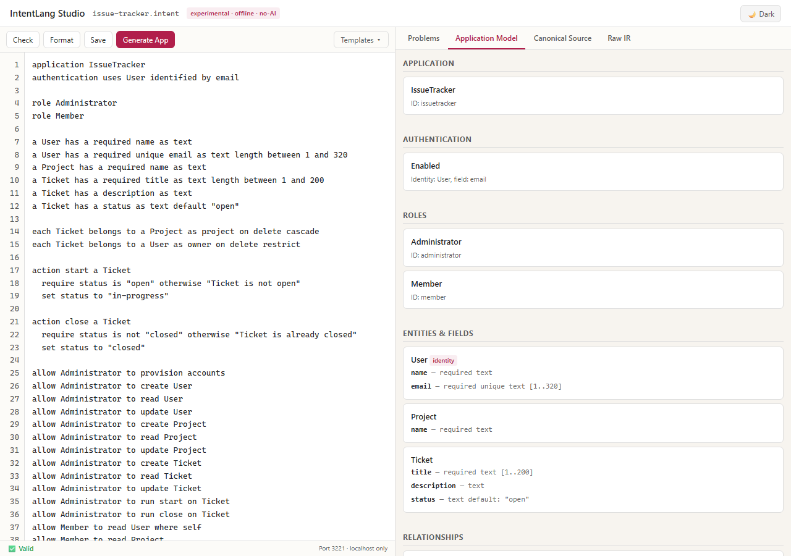
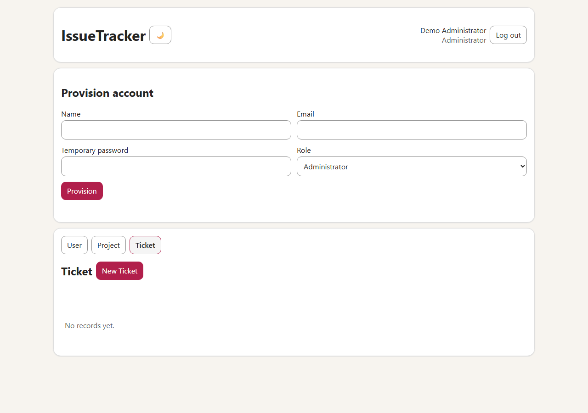

# 44 lines of English → a running full-stack Issue Tracker — without AI

> **Three things proved true:**
> - **No AI.** Zero model inference, API calls, tokens, or subscriptions at any stage — compile, generate, or run.
> - **No hand-editing.** The snapshot in `examples/issue-tracker-generated/` is raw compiler output, untouched.
> - **Fully runnable.** Frontend, backend, and database all worked: login, create, edit, ownership scoping, workflow actions, version conflicts, audit log.

---

## How it works

Write controlled English. The IntentLang compiler reads it and emits a
complete running web application. No AI is in the pipeline.

```
examples/issue-tracker.intent          (44 lines of controlled English)
              │
              ▼
     IntentLang compiler
     (deterministic, offline, no AI)
              │
     ┌────────┼────────────┐
     ▼        ▼            ▼
  Browser   Node.js     SQLite
 frontend   backend    database
(index.html (app.mjs) (migration.sql)
  app.js
 styles.css)
```

The compiler either accepts the source (valid grammar) or rejects it
with exact diagnostics. It never guesses. Same source + same compiler
version = identical output every time.

---

## Step 1: create one file and paste this code

Create a new plain-text file named:

```text
issue-tracker.intent
```

Paste the following 44 lines into that file exactly as shown.

> **This is all the application code you write.**
>
> You do **not** write the HTML, CSS, JavaScript, Node.js server, SQL
> schema, authentication system, or database code shown later. IntentLang
> generates those files from this source.

```intent
application IssueTracker
authentication uses User identified by email

role Administrator
role Member

a User has a required name as text
a User has a required unique email as text length between 1 and 320
a Project has a required name as text
a Ticket has a required title as text length between 1 and 200
a Ticket has a description as text
a Ticket has a status as text default "open"

each Ticket belongs to a Project as project on delete cascade
each Ticket belongs to a User as owner on delete restrict

action start a Ticket
  require status is "open" otherwise "Ticket is not open"
  set status to "in-progress"

action close a Ticket
  require status is not "closed" otherwise "Ticket is already closed"
  set status to "closed"

allow Administrator to provision accounts
allow Administrator to create User
allow Administrator to read User
allow Administrator to update User
allow Administrator to create Project
allow Administrator to read Project
allow Administrator to update Project
allow Administrator to create Ticket
allow Administrator to read Ticket
allow Administrator to update Ticket
allow Administrator to run start on Ticket
allow Administrator to run close on Ticket
allow Member to read User where self
allow Member to read Project
allow Member to create Ticket with owner as self
allow Member to read Ticket where owner is self
allow Member to update Ticket where owner is self
allow Member to run start on Ticket where owner is self
allow Member to run close on Ticket where owner is self
```

Save the file. Your application source is now complete.

The remaining steps check this file and ask IntentLang to generate the
full stack.

**What these 44 lines say:** the source is grouped into four logical blocks:

| Lines | Block | What it says |
|---|---|---|
| 1–4 | App declaration + auth | Name the app; use `User.email` as the login identifier |
| 5–6 | Roles | Two named roles; access is **default-deny** — nothing is allowed until stated |
| 7–15 | Entities and relationships | Three entities, their fields, and how Ticket links to Project and User |
| 16–24 | Workflow actions | Two guarded transitions: `start` (open → in-progress) and `close` (not-closed → closed) |
| 25–43 | Permission rules | Every allowed operation stated explicitly — one line, one permission |

No logic is hidden. The compiler rejects ambiguous or unsupported phrases.
If a line is valid, it does exactly what it says.

---

## What appeared — Studio and the running app

### IntentLang Studio

Open the source in Studio and the **Application Model** panel shows you
exactly what the compiler understood — entities, fields, roles, actions,
and a permission matrix — before a single line of code is generated.



Studio is a local browser tool that runs on `127.0.0.1` only. It never
sends your source to any external service.

### The generated Issue Tracker app

After clicking **Generate App** in Studio (or running the CLI), the
browser app appeared at `http://127.0.0.1:3210`. The screenshot below
shows the generated logged-in application shell before demo records were
added: account provisioning, entity navigation, and the generated
**New Ticket** control are already present. A logged-in Administrator can
create projects, provision member accounts, and manage tickets. A Member
can only see their own tickets.



---

## What was generated

The compiler produced exactly seven files from the 44-line source:

| Layer | File | What it does |
|---|---|---|
| **Frontend** | `index.html` | HTML shell; shows only a login form until authenticated |
| **Frontend** | `app.js` | All browser behavior: login, entity navigation, tables, forms, action dialogs, CSRF, idempotency |
| **Frontend** | `styles.css` | Light/dark theme (Clawpilot style) |
| **Backend** | `app.mjs` | Node.js HTTP server: all routes, auth, CRUD, workflow actions, sessions, CSRF, idempotency, audit log |
| **Database** | `migration.sql` | SQLite DDL: tables, constraints, foreign keys, unique index |
| **IR** | `intentlang.manifest.json` | Full typed intermediate representation + SHA-256 fingerprint |
| **Backend** | `package.json` | Minimal runtime descriptor |

Not a single one of these files was written or edited by hand.

---

## What we actually tested

The following steps were run against the live generated server:

1. **Bootstrap** — started the server with bootstrap credentials set via
   environment variables (never typed into shell history). The server created
   the first Administrator account and printed a listening message.

2. **Admin login** — logged in at `http://127.0.0.1:3210`. The app revealed
   the navigation bar (Users, Projects, Tickets, Provision) and showed the
   Administrator role in the header.

3. **Create a project** — filled the "New Project" form, submitted. Project
   appeared in the list immediately.

4. **Provision a Member account** — used the Provision form to create a
   Member. The server hashed the password with `scrypt` and created the
   account.

5. **Member login + forced ownership** — logged in as the Member. Created a
   Ticket while trying to set a different `owner_id` in the form. The server
   ignored the spoofed owner and assigned the logged-in user — enforcing
   `with owner as self`.

6. **Member isolation** — provisioned a second Member. Their `GET /tickets`
   returned an empty list. Fetching the first Member's ticket by ID returned
   404, hiding its existence — not 403.

7. **Workflow: start** — ran the `start` action on the Ticket. Status changed
   to `"in-progress"`. Version incremented to 2.

8. **Idempotent replay** — replayed the same action request with the same
   `Idempotency-Key`. Server returned `Idempotency-Replayed: true` and the
   same body. No second DB write occurred.

9. **Workflow: close** — ran `close`. Status became `"closed"`.

10. **Invalid transition** — tried to run `start` on the closed ticket.
    Server returned 409 `PRECONDITION_FAILED: "Ticket is not open"`. Version
    did not change.

11. **Version conflict** — replayed an earlier `PUT` with `expectedVersion: 1`
    after the record was already at version 3. Server returned 409
    `VERSION_CONFLICT`.

12. **Audit check** — queried the audit table. Every operation was recorded.
    No row contained `password`, `token`, `csrf_token`, or `session` keys —
    the server strips them before writing.

---

## Try it yourself

**Prerequisites:** [Node.js 24+](https://nodejs.org) and `git`.

```bash
git clone https://github.com/sethiramicrosoft/intentlang.git
cd intentlang
npm install
npm run build
```

**Open the source in Studio:**

```bash
node dist/src/cli.js studio examples/issue-tracker.intent
```

Studio opens at `http://127.0.0.1:3211`. Click **Generate App** to emit
the seven artifacts into `examples/issue-tracker-app/`.

**Or generate from the command line:**

```bash
node dist/src/cli.js generate examples/issue-tracker.intent \
  --output examples/issue-tracker-app --write --force
cd examples/issue-tracker-app && npm install
```

**Bootstrap and run** (set credentials safely — never type passwords into
shell history):

→ See the **[Safe bootstrap and run](../README.md#safe-bootstrap-and-run-no-credential-literals)**
section in the root README for Windows PowerShell and macOS/Linux
instructions.

After the server starts, open `http://127.0.0.1:3210`.

---

## Where is the code?

The committed generated-artifact snapshot lives at
[`examples/issue-tracker-generated/`](../examples/issue-tracker-generated/).
You can read every file — nothing is obfuscated.

| File | What to look for |
|---|---|
| [`app.mjs`](../examples/issue-tracker-generated/app.mjs) | Routes, auth, authorization, actions, audit |
| [`app.js`](../examples/issue-tracker-generated/app.js) | Browser behavior, permission-aware rendering |
| [`migration.sql`](../examples/issue-tracker-generated/migration.sql) | SQLite schema |
| [`intentlang.manifest.json`](../examples/issue-tracker-generated/intentlang.manifest.json) | Full typed IR + fingerprint |

> You do not need to understand or read the generated code to use
> IntentLang — just as you do not inspect machine code to use an ordinary
> programming language. The source is `examples/issue-tracker.intent`.

---

## Honest boundaries

- **Controlled English, not arbitrary English.** The grammar is fixed and
  published. The compiler rejects anything it does not recognise.
- **Experimental and local-only.** v0.6.0-alpha is not production-ready,
  not independently security-audited, and runs on a single process on
  `127.0.0.1`.
- **Current scope gaps:** no delete endpoints, no OAuth/MFA/password reset,
  no PostgreSQL, no search/filter/pagination, no cloud deployment story.
- **Still requires a terminal.** The long-term goal is to make IntentLang
  accessible without a terminal; that work is not yet done.

---

## Want the full technical detail?

Every pipeline step, generated-code excerpt, security architecture note,
troubleshooting guide, and reproduction checklist is in the optional
technical appendix:

→ **[`docs/issue-tracker-technical-reference.md`](issue-tracker-technical-reference.md)**
  — for developers and auditors who want to understand every generated line.
