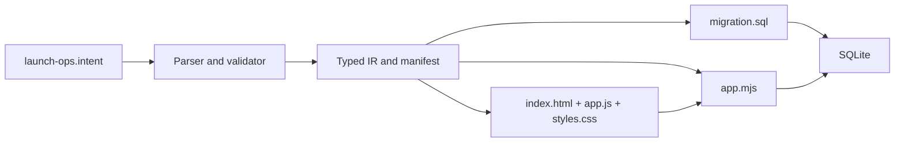
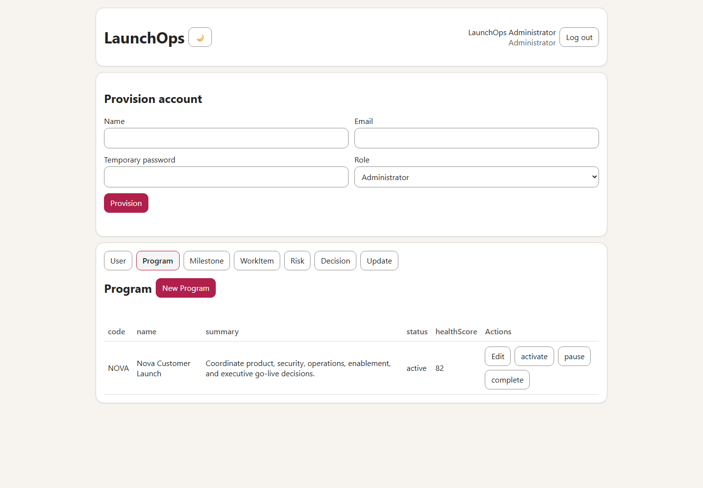
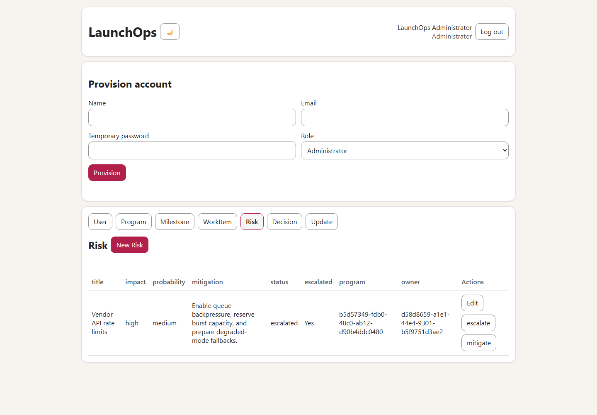
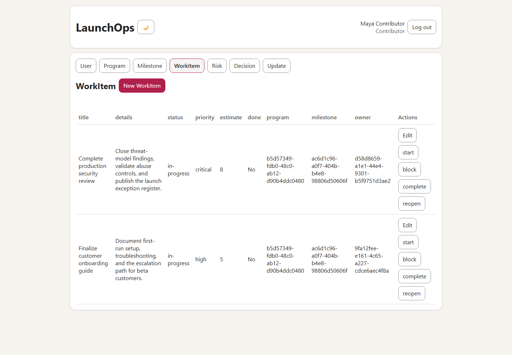
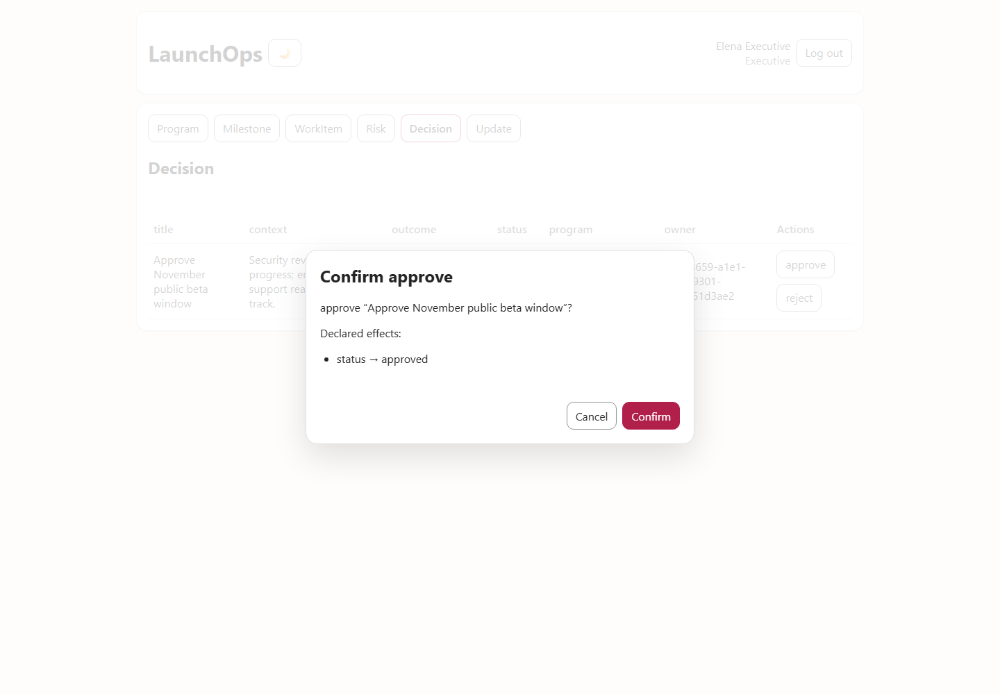
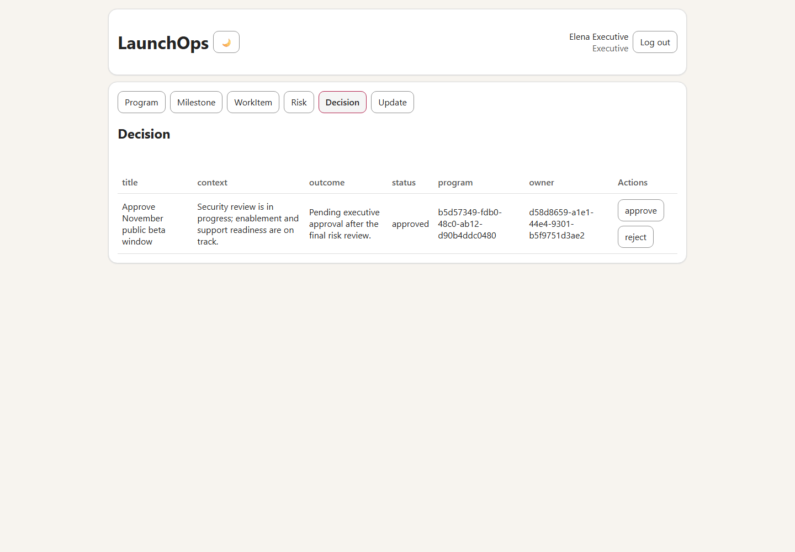

# LaunchOps: controlled English to a full-stack application

LaunchOps is the flagship IntentLang example: an authenticated program-launch
management application generated deterministically from one controlled English
source file.

> **The source is the specification and the program.** The generated
> JavaScript, SQL, HTML, and CSS are compiler output; they were not handwritten
> to make the example work.

## Start here

- **English source:** [`examples/launch-ops.intent`](../examples/launch-ops.intent)
- **Generated snapshot:** [`examples/launch-ops-generated/`](../examples/launch-ops-generated/)
- **SQL schema:** [`migration.sql`](../examples/launch-ops-generated/migration.sql)
- **Typed application model:** [`intentlang.manifest.json`](../examples/launch-ops-generated/intentlang.manifest.json)
- **Browser frontend:** [`app.js`](../examples/launch-ops-generated/app.js)
- **Node.js backend:** [`app.mjs`](../examples/launch-ops-generated/app.mjs)

## What the application manages

| Entity | Purpose | Representative workflow |
|---|---|---|
| Program | Overall launch initiative and health | planning → active → paused/complete |
| Milestone | Delivery checkpoint within a program | planned → active → complete |
| WorkItem | Owned operational work with priority and estimate | open → in-progress/blocked → done → reopened |
| Risk | Impact, probability, mitigation, and escalation | open → escalated/mitigated |
| Decision | Governance decision awaiting an outcome | pending → approved/rejected |
| Update | Red/amber/green launch communication | draft → published |
| User | Authenticated identity and record ownership | provisioned by an Administrator |

The complete source compiles with:

- 7 entities
- 31 business fields
- 10 foreign-key relationships
- 14 guarded workflow actions
- 4 roles
- 95 expanded explicit permissions from 24 policy, grant, and policy-body lines
- 0 compiler diagnostics

## The English is executable

An entity declaration:

```text
a Risk has a required title as text length between 2 and 200
a Risk has an impact as text default "medium"
a Risk has a probability as text default "medium"
a Risk has a mitigation as text
a Risk has a status as text default "open"
a Risk has an escalated as boolean default false
```

generates all of these:

- SQLite columns and constraints
- Backend request validation
- REST create/read/update routes
- Browser form controls
- Table columns
- Typed manifest entries

A relationship declaration:

```text
each Risk belongs to a Program as program on delete cascade
each Risk belongs to a User as owner on delete restrict
```

generates foreign keys, relationship selectors, API fields, and deletion
behavior.

A workflow declaration:

```text
action escalate a Risk
  require escalated is false otherwise "Risk is already escalated"
  set escalated to true
  set status to "escalated"
```

generates:

- An **escalate** button where the current role may use it
- A confirmation dialog listing the declared effects
- `POST /risks/:id/actions/escalate`
- Server-side precondition evaluation
- An atomic database update
- Optimistic version handling
- Idempotent replay handling
- An audit-log record

A concise policy:

```text
policy ContributorAccess
  allow to create and update own Risk
  allow to run all actions on own Risk

grant ContributorAccess to Contributor
```

expands before validation into the same explicit permissions that control both
the browser experience and backend authorization. LaunchOps authors 24
abstraction lines instead of 95 repeated permission lines, a 74.7% reduction,
while an executable equivalence test proves that the canonical `ProgramIr` and
semantic fingerprint are unchanged. Hiding a button is not the security
boundary: the generated server independently rejects unauthorized requests and
filters owner-scoped records.

## Role model

| Role | Capabilities |
|---|---|
| Administrator | Provision accounts; manage all entities; execute every workflow |
| ProgramManager | Manage launch records and most workflows; cannot provision accounts or approve executive decisions |
| Contributor | Read shared launch context; create and modify owned WorkItems, Risks, and Updates; run workflows only on owned records |
| Executive | Read the launch portfolio; approve or reject pending Decisions; no general create/edit access |

IntentLang uses default-deny authorization: a role receives no operation unless
an `allow` statement grants it.

## What the compiler generated



| File | Responsibility |
|---|---|
| `app.mjs` | Node.js HTTP server, login, sessions, password hashing, authorization, CRUD, workflows, CSRF, idempotency, concurrency, and audit logging |
| `app.js` | Browser navigation, tables, create/edit dialogs, relationship selectors, permission-aware controls, workflow confirmations, and API calls |
| `migration.sql` | Seven tables, constraints, foreign keys, and unique indexes |
| `index.html` | Login shell, provisioning form, application layout, dialogs, and embedded application schema |
| `styles.css` | Responsive light/dark UI |
| `intentlang.manifest.json` | Canonical typed representation and deterministic compiler fingerprint |

## Screenshots from the real walkthrough

### Administrator: active program

The Administrator can provision accounts, create records, edit them, and run
all declared workflows.



### Administrator: escalated risk

The generated UI shows the risk fields, relationships, and allowed workflow
buttons.



### Contributor: owner-scoped work

The Contributor can create work with ownership forced by the server. They can
modify and transition owned records while seeing only their own User record.



### Executive: declared approval effect

The Executive cannot create or edit Decisions. They can approve or reject a
pending Decision, and the confirmation dialog displays the exact declared state
change before execution.



After confirmation, the persisted Decision status is `approved`:



## End-to-end scenario that was verified

The Playwright walkthrough in
[`launch-ops-drive.mjs`](../launch-ops-drive.mjs) performs a real multi-session
browser test:

1. Sign in as the bootstrap Administrator.
2. Provision Contributor and Executive accounts.
3. Create a Program and connected Milestone.
4. Create a WorkItem, Risk, Decision, and Update with real relationships.
5. Activate the Program and Milestone.
6. Start work, escalate the Risk, and publish the Update.
7. Sign in as a Contributor and create owner-scoped work.
8. Verify the Contributor sees exactly their own User record.
9. Sign in as an Executive.
10. Verify create controls are absent.
11. Approve the pending Decision.
12. Verify the persisted status is `approved`.

The final run completed with zero browser errors.

## Run it locally

### 1. Install and validate IntentLang

```powershell
npm install
npm run check
node --import tsx src\cli.ts check examples\launch-ops.intent
```

Expected compiler summary:

```text
Application: LaunchOps
Entities: 7
Fields: 31
Relationships: 10
Actions: 14
Authentication: enabled
Roles: 4
Permissions: 95
Diagnostics: 0
```

### 2. Generate a live copy

Keep the committed snapshot read-only:

```powershell
node --import tsx src\cli.ts generate examples\launch-ops.intent `
  --output examples\launch-ops-app --write --force
```

### 3. Bootstrap safely

Do not place passwords in source files or shell history:

```powershell
$secure = Read-Host "Bootstrap password" -AsSecureString
$ptr = [Runtime.InteropServices.Marshal]::SecureStringToBSTR($secure)
$plain = [Runtime.InteropServices.Marshal]::PtrToStringBSTR($ptr)

$env:INTENTLANG_BOOTSTRAP_NAME = Read-Host "Administrator name"
$env:INTENTLANG_BOOTSTRAP_EMAIL = Read-Host "Administrator email"
$env:INTENTLANG_BOOTSTRAP_PASSWORD = $plain

node examples\launch-ops-app\app.mjs
```

Open `http://127.0.0.1:3210`.

After startup, clear the environment variables:

```powershell
Remove-Item Env:INTENTLANG_BOOTSTRAP_NAME -ErrorAction SilentlyContinue
Remove-Item Env:INTENTLANG_BOOTSTRAP_EMAIL -ErrorAction SilentlyContinue
Remove-Item Env:INTENTLANG_BOOTSTRAP_PASSWORD -ErrorAction SilentlyContinue
[Runtime.InteropServices.Marshal]::ZeroFreeBSTR($ptr)
$plain = $null
```

## What this example proves

- **Controlled English can define more than a schema.** It defines data,
  relationships, workflows, roles, permissions, and ownership rules.
- **Compilation is deterministic and AI-free.** No model is called during
  checking, generation, or runtime.
- **The output is conventional software.** Users can inspect the generated
  JavaScript, SQL, HTML, CSS, and JSON.
- **Security is generated across layers.** The UI reflects permissions, while
  the backend remains the enforcement boundary.
- **The generated app is executable.** The proof uses real authentication,
  browser sessions, database writes, workflow transitions, and role changes.

## Honest boundaries

LaunchOps demonstrates the current supported grammar; it is not evidence that
arbitrary English can generate arbitrary software. Current limitations include:

- Experimental software; not independently security-audited or production-ready
- SQLite and local Node.js runtime only
- No safe delete endpoint
- No OAuth, MFA, password reset, or email verification
- No native date, money, enum, reporting, charting, search, or sorting types
- Generated relationship cells currently display record IDs in tables
- Custom business calculations require additional language/compiler features

Unsupported requirements should be added to the language deliberately, with
grammar, validation, code generation, and tests—not guessed at runtime.
