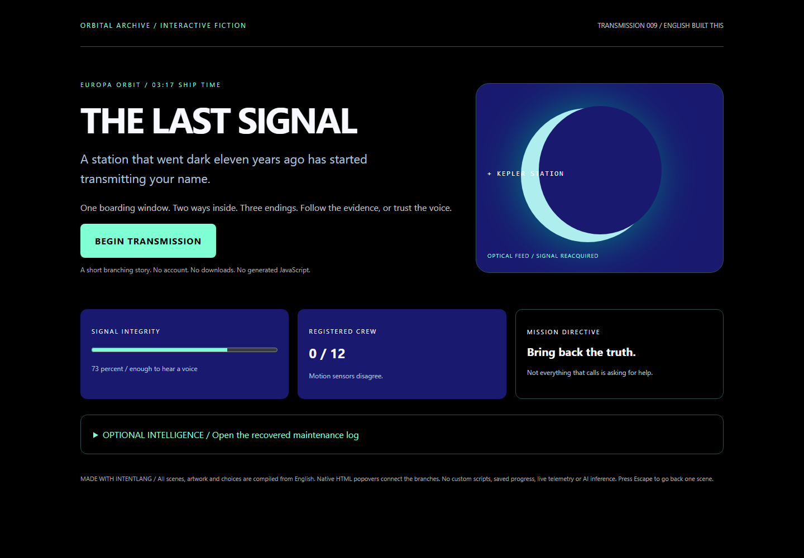
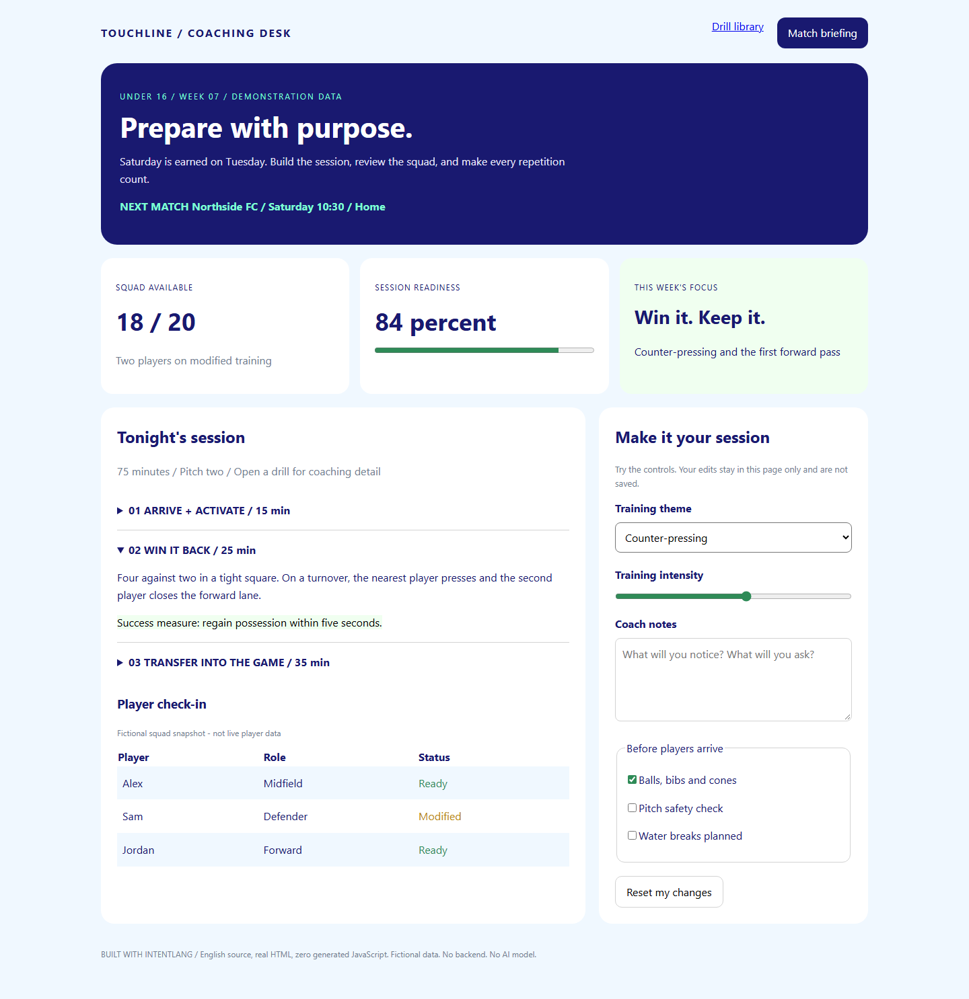
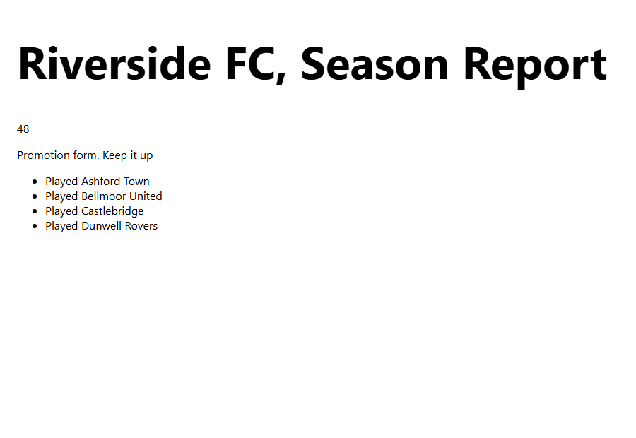
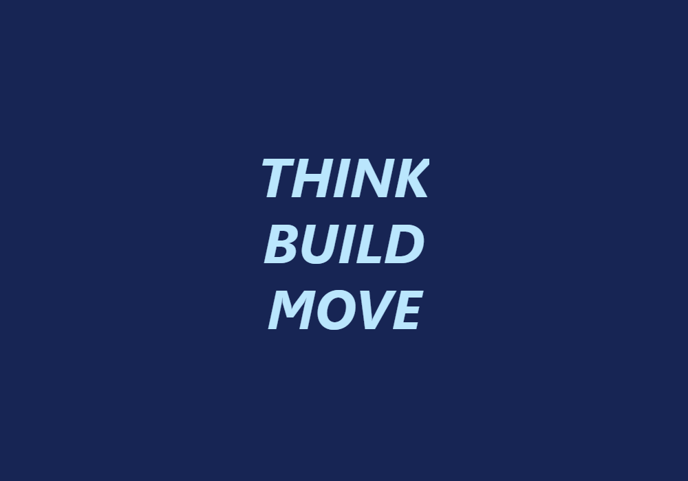

# Built with English

These are real outputs from IntentLang's existing compiler, not mockups or
handwritten HTML demos. Each source file is controlled English; the compiler emits
standalone HTML and CSS. The examples contain no generated JavaScript, external
images, remote fonts, or runtime AI calls.

**To play:** download an HTML file using the links below, then open it in a current
browser. If GitHub shows source instead, use **Download raw file** on the file page,
or save the raw link as an `.html` file. GitHub's repository viewer does not execute
HTML. You can also clone the repository and open the files directly from `examples`.
No Node.js installation or running server is needed to view the compiled outputs.

## The Last Signal

A station that went dark eleven years ago has started transmitting your name.
Choose a route, investigate the evidence, and discover three endings.



**[English source](last-signal.visual.intent)** ·
**[HTML file](last-signal.html)** ·
**[Download HTML](https://github.com/sethiramicrosoft/intentlang/raw/refs/heads/main/examples/last-signal.html)**

Click **Begin Transmission**, follow the choices, and open the optional maintenance
log for a clue. Ending buttons let you reconsider your choice; Escape goes back
one scene. Use a current browser with native HTML popover support.

The choices are connected with ordinary language:

```text
Add a button called rescue choice inside medical
Set the text of rescue choice to Bring the survivor home
Set the popover target of rescue choice to dawn ending
```

This excerpt refers to scenes declared elsewhere in the complete source.
The moon is CSS artwork, not an image. Navigation uses native HTML popovers:
there is no general game engine, inventory, live telemetry, or saved progress.

## Touchline

A responsive coaching dashboard with session cards, an expandable drill library,
a player-readiness table, and editable planning controls.



**[English source](matchday.visual.intent)** ·
**[HTML file](matchday.html)** ·
**[Download HTML](https://github.com/sethiramicrosoft/intentlang/raw/refs/heads/main/examples/matchday.html)**

Open **Match briefing**, expand a drill, change the training theme and intensity,
write notes, and tick the checklist. **Reset my changes** restores the form's
initial values. Resize the browser to see the layout wrap.

```text
Add a slider called intensity inside plan form
Set the min of intensity to 1
Set the max of intensity to 10
Set the value of intensity to 6
Set the style width of intensity to 100 percent
Set the accent color of intensity to seagreen
```

`plan form` is declared earlier in the full source. All people and metrics are
fictional demonstration data. Form edits stay in the current page and are not
saved or submitted. There is no backend.

## Season Scoreboard

Plain-English variables, a conditional message, and a repeated list, computed at
compile time (no generated JavaScript, still).



**[English source](season-scoreboard.visual.intent)** ·
**[HTML file](season-scoreboard.html)** ·
**[Download HTML](https://github.com/sethiramicrosoft/intentlang/raw/refs/heads/main/examples/season-scoreboard.html)**

The whole language addition is four sentence shapes, written as plain prose:

```text
The wins is 14.
The points is the points from wins plus the draws.
If the points is at least 40, set the text of form line to Promotion form.
For each opponent in Ashford Town, Bellmoor United, Castlebridge and Dunwell Rovers, add a list item called result opponent inside fixtures
```

These are resolved before compilation, so the output is still static HTML: no
scripts, no runtime state, no user input handling yet. See
[the language reference](../docs/visual-language.md#plain-english-variables-conditions-and-repetition)
for what this can and cannot do today.

## Words in Motion

An animated poster built from just five instructions. This is the complete source:

```text
Show the words THINK, BUILD and MOVE on separate lines
Make it 80 pixels, bold and italic
Make the text light blue
Make the background navy
Slide the text from bottom to top over 8 seconds
```



**[English source](words-in-motion.visual.intent)** ·
**[HTML file](words-in-motion.html)** ·
**[Download HTML](https://github.com/sethiramicrosoft/intentlang/raw/refs/heads/main/examples/words-in-motion.html)**

Open the HTML to see the movement; the image above is a still frame. Reload to
replay. Movement is disabled when your operating system requests reduced motion.

## Edit and regenerate

To edit any example in the playground, run `npm run sample:studio`, open
`http://127.0.0.1:3211/playground`, and paste its English source into the editor.
Download your changes before closing the tab.

To regenerate all three outputs from the repository root after installing
dependencies:

```powershell
node --import tsx src\cli.ts visual examples\last-signal.visual.intent --output examples\last-signal.html --write --force
node --import tsx src\cli.ts visual examples\matchday.visual.intent --output examples\matchday.html --write --force
node --import tsx src\cli.ts visual examples\season-scoreboard.visual.intent --output examples\season-scoreboard.html --write --force
node --import tsx src\cli.ts visual examples\words-in-motion.visual.intent --output examples\words-in-motion.html --write --force
```

Run `npm run test:browser` to check example/output consistency, the story's routes,
dashboard controls, and existing playground behavior. Screenshots were captured
from the generated HTML in Chromium; they are not design illustrations.

These examples demonstrate the current controlled-English language, not arbitrary
English understanding or full HTML/CSS/JavaScript coverage. See the
[language reference](../docs/visual-language.md) for supported constructions and
restrictions.
